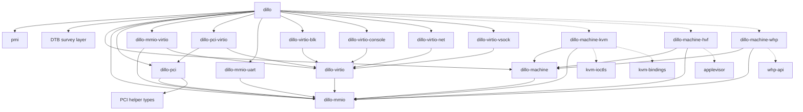

# dillo crate split design

Status: design target. This is not an implementation plan. It defines the crate
boundaries and trait contracts needed for the `dillo` binary to compose PMI,
DTB-derived slots, devices, transports, and one host `Machine` implementation
without exposing KVM, HVF, or WHP APIs above backend crates.

## Empirical inputs

This design is derived from current code and primary specs.

| Fact | Evidence |
| --- | --- |
| PMI `.pmi.vm` launch order is read target, initialize hypervisor state, process actions, initialize boot vCPU, start guest. | `pichi-vm/pmi` `spec/vm.md:16` |
| PMI requires `vm:vcpu` and `cpu:profile`; both must match `PE.FileHeader.Machine`. | `pichi-vm/pmi` `spec/vm.md:26`, `spec/cpu.md:14` |
| PMI `merged` base DTB is platform definition; overlay may contribute only CPUs, memory, distance-map, and `numa-node-id`. | `pichi-vm/pmi` `spec/merged.md:31`, `spec/merged.md:53`, `spec/merged.md:98` |
| Arma defines platform as motherboard/slots; dillo plugs CPUs, memory, and runtime-discovered devices into those slots. | `arma/docs/device-model.md:21`, `arma/docs/device-model.md:51` |
| Arma forbids hidden guest hardware; device addresses and interrupts come from DTB. | `arma/docs/device-model.md:91` |
| KVM confidential-computing private memory uses `guest_memfd`; private pages cannot be mapped, read, or written by userspace. Shared/private state is selected per GFN with `KVM_MEMORY_ATTRIBUTE_PRIVATE`. | Linux KVM API `KVM_SET_USER_MEMORY_REGION2`, `KVM_SET_MEMORY_ATTRIBUTES`, `KVM_CREATE_GUEST_MEMFD` |
| KVM userspace must explicitly track page private/shared state; the KVM memory attributes API has no get operation. | Linux KVM API `KVM_SET_MEMORY_ATTRIBUTES` |
| KVM returns `KVM_EXIT_MMIO` only for MMIO that could not be satisfied by KVM; `KVM_IOEVENTFD` lets a registered MMIO write signal an eventfd instead of exiting. | Linux KVM API `KVM_EXIT_MMIO`, `KVM_IOEVENTFD` |
| KVM interrupt acceleration is also registration based: `KVM_IRQFD` lets an eventfd directly trigger a guest interrupt. | Linux KVM API `KVM_IRQFD` |
| TDX VM initialization is a VM-specific operation that must occur before vCPU creation; TDX also has specific VM/vCPU/memory init commands and CPUID handling. | Linux KVM TDX API `KVM_TDX_INIT_VM`, `KVM_TDX_INIT_VCPU`, `KVM_TDX_INIT_MEM_REGION`, `KVM_TDX_GET_CPUID` |
| SEV-ES/SNP initial CPU state is launch material with platform limits; unsupported initial-state fields must fail rather than be silently configured. | QEMU IGVM documentation, "Initial CPU state with VMSA" |
| Retired `dillo-vm` proved the original backend trait and MMIO bus shape, but exposed backend-shaped associated state from the monolith. | retired `dillo/deps/dillo-vm/src/backend.rs:58` |
| Current `MmioDevice` supports multiple windows, which is required for `PciRoot` ECAM plus BAR windows. | `dillo/deps/dillo-mmio/src/lib.rs` |
| Current `PciRoot` owns ECAM plus BAR windows and implements `MmioDevice`. | `dillo/deps/dillo-pci/src/lib.rs` |
| Current `PciDevice`, `VirtioDevice`, and `MsixNotifier` are already separable traits. | `dillo/deps/dillo-pci/src/lib.rs`, `dillo/deps/dillo-virtio/src/device.rs`, `dillo/deps/dillo-pci/src/msix.rs` |
| Backend crates no longer expose PCI-specific MSI-X notifier construction; machine attachments expose generic message-interrupt domains and PCI translates MSI-X. | `dillo/deps/dillo-mmio/src/lib.rs`, `dillo/deps/dillo-pci/src/msix.rs` |
| Current `dillo-devtree::platform` proves the drain-to-empty DTB survey pattern: materialize an `OwnedTree`, run self-routing `from_tree` constructors, and fail on residual nodes/properties. | `dillo/deps/dillo-devtree/src/platform/machine.rs` |
| Current `dillo-devtree::platform` tracks region provenance and distinguishes required properties from acknowledged pass-through properties. | `dillo/deps/dillo-devtree/src/platform/machine.rs` |
| Current PMI parsing decodes `vm:vcpu` into an arch-erased parsed value; target `dillo-machine` must not invent a universal CPU-state struct. | `dillo/src/pmi_parse.rs` |
| Current vCPU execution runs through `Cpu::run()` with MMIO routing owned below the `Machine` boundary. | `dillo/deps/dillo-machine/src/lib.rs`, `dillo/deps/dillo-machine-kvm/src/lib.rs`, `dillo/deps/dillo-machine-hvf/src/lib.rs`, `dillo/deps/dillo-machine-whp/src/lib.rs` |
| vCPU exits are now backend-local implementation details in the selected machine crate; remaining conformance work should ensure only lifecycle stops cross the `dillo-machine` trait boundary. | `dillo/deps/dillo-machine-kvm/src/lib.rs`, `dillo/deps/dillo-machine-hvf/src/lib.rs`, `dillo/deps/dillo-machine-whp/src/lib.rs` |
| Current confidential-computing private-memory support is still incomplete; standard VM virtio activation now routes through shared-memory capabilities. | `dillo/deps/dillo-mmio/src/lib.rs`, `dillo/deps/dillo-virtio/src/device.rs`, `dillo/deps/dillo-virtio/src/memory.rs` |
| Virtio PCI writes now use shared-reference `PciDevice` methods with interior mutability for config space, MSI-X state, and device state. | `dillo/deps/dillo-pci-virtio/src/transport.rs` |
| Current UART interrupting is trigger-only; a level/deassert-capable interrupt line is new backend/device work. | `dillo/deps/dillo-mmio-uart/src/lib.rs` |
| CI's supported platform matrix is Linux x86-64/KVM, Windows x86-64/WHP, and macOS arm64/HVF, with warnings denied and real boot tests. | `.github/workflows/ci.yml:13`, `.github/workflows/ci.yml:92`, `.github/workflows/ci.yml:100`, `.github/workflows/ci.yml:108` |

## Name stability

Names in the target graph are proposed logical crate names unless stated
otherwise. They are not a promise that today's organic workspace crates survive
with the same names or boundaries.

Current crates are evidence and migration sources:

- `dillo-vm` should disappear as a monolith.
- `dillo-hypervisor` has been retired; its former KVM, HVF, and WHP
  implementation modules now live in the owning `dillo-machine-*` crates.
- `dillo-pmi` has been retired into `dillo::pmi_parse`.
- `dillo-platform` has been retired; DTB survey now lives in
  `dillo-devtree::platform`.
- `dillo-device` was an older process/thread experiment and is not a target
  boundary.
- `vm-pci` has been retired into `dillo-pci`.

## Target graph



Dashed edges are target-selected or architecture-selected dependencies. The
important dependency rule is stronger than the picture: backend crates never
depend on PCI, virtio transports, UART, or concrete devices; device crates never
depend on machine crates.

## Knowledge boundaries

`dillo` is the main user experience and the only composition point. It knows:

- PMI and dillo's PMI-loading module;
- the base DTB survey layer;
- every concrete device crate dillo can instantiate;
- every transport adapter crate dillo can use;
- the `dillo-machine::Machine` trait;
- exactly one selected backend package through a Cargo target dependency alias.

`dillo` must not know KVM, HVF, WHP, or raw architecture substrate details. It
may use target dependencies to bind a generic crate name, for example
`dillo_machine_backend`, to `dillo-machine-kvm`, `dillo-machine-hvf`, or
`dillo-machine-whp`.

Machine backend crates know:

- `dillo-machine`;
- `dillo-mmio`;
- their host OS hypervisor API;
- architecture machinery that is specific to that backend's execution model.

Machine backend crates do not know PCI, virtio, UART, or concrete devices. A
backend exposes an inherent constructor for its concrete `Machine`, creates and
runs vCPUs, attaches opaque `MmioDevice`s, and provides interrupt/event plumbing
through `dillo-mmio` types.

Device crates know their own device protocol and the narrow traits they
implement. Virtio devices know `dillo-virtio`. MMIO devices know `dillo-mmio`.
PCI transport devices know `dillo-pci`. Devices do not know `dillo-machine`,
PMI, DTB, KVM, HVF, or WHP.

## Crate roles

`dillo-machine` owns the host-neutral VM contract. Its main trait is
`Machine`, not `Vm`, to match the role: one realized virtual machine with vCPU
lifecycle, private guest memory ownership, shared-page mediation, MMIO
attachment, and backend-neutral run outcomes.
It does not own backend construction policy; concrete backend crates expose
inherent constructors for launch.

`dillo-mmio` owns `MmioDevice`, MMIO windows, line/message interrupt
abstractions, and the backend-neutral I/O event registration shape. It does not
own PCI, virtio, or machine construction.

`dillo-pci` owns the concrete `PciRoot` and the `PciDevice` trait. `PciRoot`
implements `MmioDevice`, owns the ECAM window plus BAR windows for one declared
PCI host bridge, and can attach `PciDevice`s into DTB-declared slot capacity.
It may use a PCI helper layer for reusable PCI config/MSI-X structures.

`dillo-pci-virtio` owns `VirtioPciDevice`, the concrete adapter from
`dillo-virtio::VirtioDevice` to `dillo-pci::PciDevice`.

`dillo-mmio-virtio` owns the concrete adapter from
`dillo-virtio::VirtioDevice` to `dillo-mmio::MmioDevice`.

`dillo-virtio` owns the transport-neutral virtio device trait and queue,
feature, kick, and activation types shared by all virtio transports and devices.

`dillo-virtio-*` crates own concrete virtio device implementations. They expose
concrete inherent constructors. They do not parse DTB and do not decide slot
occupancy.

`dillo-mmio-uart` owns a concrete MMIO 16550-compatible UART device. It exposes
an inherent constructor that takes DTB-derived MMIO window and interrupt
requirements.

Architecture-specific machinery belongs in the owning `dillo-machine-*` crate
unless it is a portable device or protocol implementation. For example, WHP owns
its userspace IOAPIC model, `dillo-mmio` owns the portable syscon MMIO device,
and `dillo-pci` owns ECAM/BAR decoding over `PciRoot`. x86 legacy PCI
configuration ports are intentionally not decoded so guests use ECAM.

The DTB survey layer consumes base DTB and overlay rules and returns typed
platform facts with provenance. This logic now lives in `dillo-devtree`; it
does not know backend crates or concrete device implementations.

`pmi` is the upstream PMI spec/data crate and must be consumed from
`https://github.com/pichi-vm/pmi`, not from a dillo-local fork. Today's
`dillo-pmi` crate is dillo-specific PE parsing, resource caps, and defensive
validation. That can become a `dillo` module unless reuse justifies a crate.

## Runtime assembly flow

`dillo` owns the only end-to-end assembly flow:

1. Read PMI and validate the image contract.
2. Decide load/fill placement and host resource placement from PMI, the base DTB,
   and requested runtime resources.
3. Generate the PMI overlay containing only host-provided CPUs, memory,
   distance-map data, and `numa-node-id`.
4. Merge base DTB plus overlay into one mutable `devtree::OwnedTree`.
5. Construct the selected concrete `Machine` from backend-owned input types
   derived from PMI plus the merged devtree.
6. Incrementally construct CPU, memory, MMIO, bus, transport, and device objects
   from the same mutable tree and attach each one to the machine.
7. Fail if any DTB node/property remains after assembly.
8. Run the attached CPUs through the machine's `Cpu` objects.

The merged devtree is therefore not drained up front into one large plan.
Consumption is incremental: each constructed object drains only the nodes and
properties it owns, then the next object sees the remaining tree. The final empty
tree check proves that all guest-visible hardware came from the DTB and that no
DTB fact was ignored.

The shape of the `dillo` orchestration is:

```rust
let pmi = PmiImage::read(input)?;
let base = pmi.base_dtb()?;
let placement = Placement::from_pmi_and_base_dtb(&pmi, &base, request)?;
let overlay = placement.overlay()?;
let mut tree = devtree::OwnedTree::merge(base, overlay)?;
let mut ctx = DevTreeContext::new(&pmi, request, &placement)?;

let model = require(KvmTdxModel::from_devtree(&mut tree, &mut ctx)?)?;
let mut machine = KvmTdxMachine::new(model)?;

for memory in KvmTdxMemory::all_from_devtree(&mut tree, &mut ctx)? {
    machine.attach(memory)?;
}

let mut vcpus = Vec::new();
for cpu in KvmTdxCpu::all_from_devtree(&mut tree, &mut ctx)? {
    vcpus.push(machine.attach(cpu)?);
}

let mut attached_mmio = Vec::new();
for device in DilloDevices::from_devtree(&mut tree, &mut ctx)? {
    let attachment = machine.attach(Arc::clone(&device))?;
    attached_mmio.push((device, attachment));
}

tree.require_empty()?;
let device_hosts = spawn_device_hosts(attached_mmio)?;
run_supervisor(vcpus, device_hosts)?;
```

The concrete backend type above is selected by the target/backend alias. The
pattern is the same for plain KVM, KVM+SEV, KVM+TDX, HVF, and WHP, but the
machine model, CPU input type, and memory input type may differ.

`attached_mmio` is handed to the selected transport or device wrapper. The
wrapper knows the concrete device protocol; the backend attachment knows the
parallel execution model. Portable wrappers pass a neutral `MmioDeviceRun`
closure to `MmioAttachment::spawn`; the attachment decides whether that work is
run in a thread, process, or backend-specific service. In all cases, the machine
has already registered MMIO routing before vCPUs run.

`run_supervisor` owns VM lifecycle. CPU worker threads run synchronous
`Cpu::run()` calls and report `VcpuStop` outcomes to the supervisor over normal
Rust channels. A guest poweroff is handled in this order:

1. One vCPU worker reports `VcpuStop::GuestPoweroff`.
2. The supervisor calls `Cpu::stop` on every still-running CPU to make each
   `Cpu::run()` return.
3. The supervisor joins all vCPU workers. At this point no guest CPU can issue
   new MMIO.
4. The supervisor requests device-host shutdown through each `MmioDeviceHandle`.
5. The supervisor joins all device hosts.
6. Machine-owned MMIO routing, interrupt routing, and memory state may drop.

Device hosts must not independently tear down guest-visible state while any vCPU
may still access it. Device-host shutdown is therefore after vCPU quiescence in
the normal poweroff path.

## Devtree consumption

Concrete devices have inherent constructors. Devtree consumption is not in
device crates.

`dillo` owns a local trait such as:

```rust
trait FromDevTree {
    type Error;
    type Context;

    fn from_devtree(
        tree: &mut devtree::OwnedTree,
        ctx: &mut Self::Context,
    ) -> Result<Option<Self>, Self::Error>
    where
        Self: Sized;
}
```

`dillo` implements this trait for concrete machine inputs, device inputs, and
adapter types because only `dillo` knows all inputs at once: PMI, the mutable
devtree, selected transport, selected concrete `Machine`, and every concrete
device type it can instantiate. This is intentionally not an independent crate.
The context is the place for cross-cutting launch facts that are not owned by a
single DTB node, such as parsed PMI state, placement decisions, and resource
plans.

Construction uses the existing drain model incrementally. `dillo` constructs one
object at a time from one mutable `devtree::OwnedTree`. Each successful
constructor removes every node and property it owns from that tree. After all
constructors and attachments run, any remaining node or property is an error.
`FromDevTree` always receives the whole tree and a mutable context; a consumer
may drain as many nodes as it owns and may update context such as topology or
resource planning. The common MMIO-device case is one DTB node defining the
device's constructor parameters: `reg` windows, interrupts, DMA/notification
facts, and device-specific properties.

This is a publicized/generalized form of today's
`dillo-devtree::platform::machine::*::from_tree(&mut OwnedTree, &mut ResourcePlan, ...)`
pattern. That code already proves the important mechanics: self-routing
constructors, `require` for properties that drive host setup, `ack` for claimed
properties whose values do not drive host setup, `ensure_drained` for per-node
coverage, origin-tracked region declaration, and a final residual-tree failure.

`Ok(None)` means the relevant node is absent and the implementation consumed
nothing. `Ok(Some(_))` means construction succeeded and all owned nodes and
properties were drained. `Err(_)` means a relevant node was present but
malformed, unsupported, or incomplete.

The rule is fail closed: if a DTB node/property is not consumed by exactly one
owner, launch fails. If dillo wants to plug a device but the base DTB did not
declare a compatible slot, launch fails. If required setup data could have been
in the DTB but is absent, dillo fails or the arma device model is extended; it
does not substitute guessed guest-visible hardware.

## Trait inventory

Every trait intended to cross a crate boundary is listed here. Traits not listed
are implementation details until proven otherwise.

- `Attach<T>`: generic registration into a constructed owner.
- `Machine`: host-neutral VM contract implemented by backend crates.
- `Cpu`: synchronous vCPU execution contract.
- `MmioDevice`: device-advertised MMIO, interrupt, and shared-memory needs.
- `PciDevice`: PCI endpoint contract consumed only by `PciRoot`.
- `SharedMemory`: attachment-scoped shared-memory capability.
- `MmioAttachment`: backend-produced runtime authority for one MMIO device.
- `InterruptLine` and `MessageInterruptDomain`: interrupt delivery contracts.

## Confidential-computing memory model

The execution model is confidential-computing first. Guest RAM is private unless
the guest-visible platform declares a shared communication surface and the
backend marks or maps the corresponding pages as shared.

The only way to access guest memory is through successful device registration.
The target API exposes shared memory only through `SharedRegion` handles minted
by `Attach<Arc<dyn MmioDevice>>` for the registered `MmioDevice` and its
declared resources. There is no whole-guest-memory accessor, no raw
guest-to-host address translation API, and no API for devices to inspect private
pages. A standard VM must fit this model by treating its otherwise-readable RAM
as if only registered device attachments could access declared shared regions.

For KVM, this maps to `guest_memfd` plus memory attributes: private pages live
in guest memory that userspace cannot map, while userspace-visible shared pages
are selected by clearing the private attribute for the relevant GFNs. Because
KVM does not provide a memory-attribute get API, the backend must track
shared/private state explicitly and fail closed on requests that do not match
its tracked state.

### `Attach`

Owned by `dillo-mmio`. Implemented by concrete composition points such as
machine backends and `dillo-pci::PciRoot`.

```rust
pub trait Attach<T> {
    type Error: std::error::Error + Send + Sync + 'static;
    type Output;

    fn attach(&mut self, item: T) -> Result<Self::Output, Self::Error>;
}
```

`Attach<T>` is not machine-specific. It is the generic operation for registering
one constructed object with another constructed object while preserving the
owner's error type and returning the registered object's runtime handle. Machine
backends use it to attach memory, CPUs, and MMIO devices. `PciRoot` uses it to
attach PCI endpoints into DTB-declared slot capacity.

### `Machine`

Owned by `dillo-machine`. Implemented by `dillo-machine-kvm`,
`dillo-machine-hvf`, and `dillo-machine-whp`. Consumed by `dillo`.

```rust
pub trait Machine: Sized + 'static {
    type Error: std::error::Error + Send + Sync + 'static;
    type Cpu: Cpu<Error = Self::Error> + Send;
    type CpuState: CpuState<Error = Self::Error>;
    type Memory: Memory<Error = Self::Error>;

    fn from_launch_config(config: LaunchConfig) -> Result<Self, Self::Error>;

    fn write_guest(&mut self, gpa: u64, data: &[u8]) -> Result<(), Self::Error>;

    fn prepare_vcpu_run(&mut self) -> Result<(), Self::Error>;

    fn reset_for_reboot(&mut self) -> Result<(), Self::Error>;
}
```

Concrete machine implementations must support the attachment set that `dillo`
uses. When `dillo` is generic over a selected machine type, the required bounds
express the shared error contract with fully qualified associated types:

```rust
where
    M: Machine,
    M: Attach<
        <M as Machine>::Memory,
        Error = <M as Machine>::Error,
        Output = (),
    >,
    M: Attach<
        <M as Machine>::CpuState,
        Error = <M as Machine>::Error,
        Output = Arc<<M as Machine>::Cpu>,
    >,
    M: Attach<
        Arc<dyn MmioDevice>,
        Error = <M as Machine>::Error,
        Output = Arc<dyn MmioAttachment>,
    >,
```

`Machine` has no `launch()` API. `dillo` constructs the selected machine through
the common trait API using only backend-neutral launch facts, then attaches typed
memory, CPU-state, and MMIO objects. The backend crate owns the concrete input
type and its validation policy. For example:

```rust
impl KvmTdxCpu {
    pub fn new(model: KvmTdxCpuModel) -> Result<Self, KvmTdxError>;
}
```

The concrete machine is assembled by attaching typed objects:

```rust
impl Attach<KvmTdxMemory> for KvmTdxMachine {
    type Error = KvmTdxError;
    type Output = ();
}

impl Attach<KvmTdxCpuState> for KvmTdxMachine {
    type Error = KvmTdxError;
    type Output = Arc<KvmTdxCpu>;
}

impl Attach<Arc<dyn MmioDevice>> for KvmTdxMachine {
    type Error = KvmTdxError;
    type Output = Arc<dyn MmioAttachment>;
}
```

`Machine::Cpu` and `Machine::Memory` are associated types because CPU and memory
attachment material differs by machine family. Plain KVM may need explicit CPU
initial register/state data. KVM+SEV and KVM+TDX may need confidential launch
material, accepted initial state, memory acceptance/private-page setup, or
opaque per-vCPU setup. `dillo-machine` must not define a universal CPU-state
type. `dillo-pmi` already parses the PMI `vm:vcpu` map into an arch-erased
parsed value, and the selected backend associated CPU input decides which PMI
arm it accepts. `dillo` may request only PMI-defined CPU count, CPU profile,
memory, load/fill, and initial state; constructing `Machine::Cpu` and
`Machine::Memory` from those facts succeeds for the selected backend or fails
closed.

`Machine` owns all guest memory, but exposes only attachment-scoped shared
regions that a confidential VM can expose. Standard VMs may implement this with
ordinary mapped memory internally, but the public API must not let callers read
or write arbitrary guest-private memory. Without a successful MMIO attachment
call, no device receives any guest-memory capability.

Attaching `Machine::Memory` grants memory ownership to the machine but does not
grant devices access to guest memory. Attaching `Arc<dyn MmioDevice>` validates
the device's DTB-derived windows, realizes interrupts, creates only the declared
shared-memory capabilities for that device, and returns a backend-implemented
`MmioAttachment`. Attaching `Machine::CpuState` returns a runnable
`Arc<Machine::Cpu>`; the CPU-state input type carries whatever non-CC or
CC-specific construction material that machine family requires.

`Machine` must stay device-model neutral. It must not expose PCI, MSI-X, UART,
IOAPIC, GIC, KVM irqfd, WHP vector, or HVF-specific concepts in its public
trait. Those details belong either in backend internals, architecture substrate
crates, or protocol adapters below `dillo`.

Interrupt needs are advertised by the `MmioDevice` being attached. `FromDevTree`
implementations drain interrupt properties from the devtree into typed
requirements stored on the constructed device. `Attach<Arc<dyn MmioDevice>>` is
obligated to resolve those requirements for the backend, fail if it cannot, and
return the resulting handles through its backend-specific `MmioAttachment`
implementation.

Device execution policy is owned by backend attachments. Portable MMIO and
virtio crates expose only neutral run closures, shutdown tokens, and join
handles; the backend-implemented `MmioAttachment` decides whether those workers
run in threads, processes, or another backend-specific service.

### `Cpu`

Owned by `dillo-machine`. Implemented by backend crates.

```rust
pub trait Cpu: Send + Sync + 'static {
    type Error: std::error::Error + Send + Sync + 'static;

    fn run(&self) -> Result<VcpuStop, Self::Error>;

    fn stop(&self) -> Result<(), Self::Error>;
}

pub enum VcpuStop {
    GuestPoweroff,

    GuestReset,

    Stopped,
}
```

`Cpu::run` hides KVM `VcpuExit`, HVF syndrome decoding, and WHP emulator
callbacks from dillo and devices. The only guest I/O exit that participates in
the shared machine/device boundary is MMIO, and even that is routed inside the
machine after `Attach<Arc<dyn MmioDevice>>`. PIO, hypercalls, CPUID leaves,
PSCI calls, WFI/HLT, debug exits, and backend-specific emulation exits are
backend or architecture-substrate internals and must not become dillo/device
APIs.

`Cpu::run` has no external MMIO callback argument.
`Attach<Arc<dyn MmioDevice>>` registers the device's MMIO windows in
machine-owned routing state, and vCPUs created by that machine carry whatever
handle they need to route unresolved MMIO exits internally. On Linux/KVM,
the returned `MmioAttachment` may also bind ioeventfd for MMIO writes so those
notifications bypass the vCPU thread. Interrupt delivery likewise uses resolved
`Interrupt` or `MessageInterruptDomain` handles exposed by the returned
attachment; it is not sent through the vCPU run loop.

`VcpuStop` is a report to the supervisor, not a complete shutdown sequence.
Architecture-specific shutdown triggers such as PSCI system-off, syscon
poweroff, ACPI power button, or guest reset are decoded inside backend or
architecture-substrate code and surfaced as `VcpuStop`. Backend failures are
returned as `Err(Self::Error)`. The supervisor owns the fan-out. It calls
`Cpu::stop` on the still-running CPUs to make outstanding synchronous
`Cpu::run()` calls return, then joins every CPU worker before
shutting down device hosts. This keeps shutdown policy out of devices and out of
backend-specific vCPU exit types.

Fatal execution failures use `Err(Self::Error)`, not a second `VcpuStop`
variant. `VcpuStop` is reserved for guest or supervisor lifecycle outcomes where
the supervisor may make a policy decision after a successful `run()` return.

PSCI/HVC/SMC handling, including secondary CPU bring-up from `CPU_ON`, lives in
the backend or architecture substrate and coordinates with machine-owned CPU
parking/wakeup state. WFI/HLT stays backend-internal. The old `DILLO_GDB` debug
path is out of scope for this refactor and must not be smuggled through
`VcpuStop::Debug`.

`Cpu::stop` is not cancellation of arbitrary Rust work, reset control, or device
shutdown. It is the backend's per-CPU run-exit mechanism. Its only contract is:
after it succeeds, a currently running `Cpu::run()` call for that CPU will
return promptly. If a backend cannot make a blocked CPU leave `run()`, it cannot
implement reliable guest poweroff for this model.

For Linux/KVM, `Cpu::stop` is implemented by making that CPU thread's
`KVM_RUN` ioctl return `-EINTR`. KVM documents two relevant facts:

- `KVM_RUN` returns `EINTR` when an unblocked signal is pending for the vCPU
  thread.
- `struct kvm_run::immediate_exit` is the common signal-kick path; when set
  nonzero before `KVM_RUN`, the next run exits immediately with `EINTR`, and a
  signal handler can set it to keep a kicked vCPU from re-entering the guest.

Therefore the KVM backend keeps per-CPU run records. When a CPU worker thread
enters `Cpu::run()`, the KVM CPU records the current Linux thread identity and
the mmap'd `kvm_run` pointer. `Cpu::stop` sets the stop flag, marks that CPU's
`immediate_exit`, and sends a thread-directed signal such as `pthread_kill` or
`tgkill` to that CPU worker thread. The signal is sent to the vCPU worker
thread, not to an arbitrary process PID. When `KVM_RUN` returns `EINTR`,
`Cpu::run()` checks the stop flag and returns
`VcpuStop::Stopped` instead of re-entering KVM.

For macOS/HVF, each CPU owns the run-exit handle needed by the local HVF
wrapper. `Cpu::stop` sets the CPU stop flag and calls the HVF exit helper for
that CPU. When `hv_vcpu_run` returns, `Cpu::run()` checks the stop flag and
returns `VcpuStop::Stopped`.

For Windows/WHP, the backend must store the partition handle and each virtual
processor index in the CPU object. `Cpu::stop` sets the CPU stop flag and calls
`WHvCancelRunVirtualProcessor(partition, vp_index, 0)`. `WHvRunVirtualProcessor`
then returns with `WHvRunVpExitReasonCanceled`, which the backend translates to
`VcpuStop::Stopped` when the stop flag is set.

### `MmioDevice`

Owned by `dillo-mmio`. Implemented by MMIO devices and by `dillo-pci::PciRoot`.

```rust
pub struct MmioWindow {
    pub base: u64,
    pub size: u64,
}

pub enum MmioInterruptRequirement {
    Line { source: InterruptSource },

    MessageDomain {
        source: MessageInterruptSource,
        vectors: u16,
    },
}

pub struct SharedMemoryRequirement {
    pub range: AddressRange,
    pub access: SharedAccess,
}

pub enum SharedAccess {
    ReadOnly,
    WriteOnly,
    ReadWrite,
}

pub trait MmioDevice: Send + Sync + std::fmt::Debug {
    fn windows(&self) -> &[MmioWindow];
    fn interrupts(&self) -> &[MmioInterruptRequirement];
    fn shared_memory(&self) -> &[SharedMemoryRequirement];
    fn read(&self, window: &MmioWindow, offset: u64, data: &mut [u8]) -> Result<(), MmioError>;
    fn write(&self, window: &MmioWindow, offset: u64, data: &[u8]) -> Result<(), MmioError>;
}
```

The resource methods are DTB-derived device metadata, not hardware-enablement
decisions. `Attach<Arc<dyn MmioDevice>>` registers the declared windows into
machine-owned MMIO routing state, realizes the declared interrupt and
shared-memory requirements, returns a backend-implemented `MmioAttachment`, and
fails closed if any requirement cannot be satisfied. PCI is therefore invisible
to machine backends; a PCI host bridge is just one MMIO device with windows,
shared-memory requirements, and interrupt requirements from their point of view.

The resource slices are borrowed fixed constructor state, not values to allocate
or recompute during attachment. They must be stable for the lifetime of the
device. This is the device's claim over DTB-derived resources, not a negotiation
hook. Requirements do not carry public names. The machine realizes requirements
in slice order, and the attachment exposes resolved handles in the same order. A
device that needs semantic labels for its own windows or interrupts keeps those
labels in its own concrete type. The machine validates that all windows are
nonzero, non-overlapping, outside guest RAM unless the DTB explicitly defines
the aperture, and compatible with the selected backend. MMIO read/write methods
are called only after a successful attachment. If a routed access is malformed
or unsupported, the device returns `Err`; the machine treats that as a VM
execution error rather than silently ignoring the access.

Shared-memory requirements are capabilities, not static shared pages. The DTB
may describe the device's DMA aperture or shared-memory eligibility, but virtio
queue descriptors and buffers are runtime guest protocol state. The target model
flattens shared-memory requirements: one `SharedMemoryRequirement` describes one
range and access mode. A device that has multiple apertures returns multiple
entries. A device gets one shared-memory capability per entry through the
attachment returned by machine `Attach`; each requested runtime range must be
inside that capability and must currently be tracked as shared by the backend.
MMIO windows, PCI ECAM, and BAR apertures are not automatically shared-memory
capabilities.

### `PciDevice`

Owned by `dillo-pci`. Implemented by `dillo-pci-virtio::VirtioPciDevice` and
future PCI endpoint devices.

```rust
pub trait PciDevice: Send + Sync + std::fmt::Debug {
    fn config_read(&self, reg_idx: usize) -> Result<u32, PciError>;
    fn config_write(&self, reg_idx: usize, offset: u64, data: &[u8])
        -> Result<(), PciError>;
    fn bar_regions(&self) -> &[BarRegion];
    fn bar_read(&self, bar_idx: u8, offset: u64, data: &mut [u8])
        -> Result<(), PciError>;
    fn bar_write(&self, bar_idx: u8, offset: u64, data: &[u8]) -> Result<(), PciError>;
}
```

`PciDevice` uses shared references because PCI endpoints sit behind `PciRoot`,
and `PciRoot` is itself an `MmioDevice` whose MMIO callbacks take `&self`.
Mutable endpoint state therefore lives behind endpoint-owned synchronization or
interior mutability. BAR declarations are borrowed fixed constructor state, just
like `MmioDevice` windows. Virtio PCI transport state, MSI-X state, config
space, and device access must stay internally synchronized so this shared
reference trait remains safe.

### `PciRoot`

`PciRoot` is a concrete type owned by `dillo-pci`, not a trait. It implements
`MmioDevice` and attaches `PciDevice`s.

```rust
pub struct PciRootOptions {
    pub ecam: MmioWindow,
    pub slots: u8,
    pub bar_window: AddressRange,
    pub message_interrupts: MessageInterruptSource,
}

impl Attach<Arc<dyn PciDevice>> for PciRoot {
    type Error = PciAttachError;
    type Output = PciFunction;
}
```

One `PciRoot` instance owns all guest MMIO windows for the declared PCI host:
ECAM, BAR windows, and MSI-X table/PBA BARs that belong to attached devices.
`Attach<Arc<dyn PciDevice>>` assigns a DTB-declared PCI slot/function and folds
the endpoint's BARs into the root's PCI MMIO routing. The backend receives only
the single `PciRoot` as an `MmioDevice`. `PciRoot` or `dillo-pci-virtio` adapts
PCI MSI/MSI-X table updates to the generic message-interrupt service; machine
backends never see PCI transport types.

PCI endpoints do not attach directly to `Machine` and do not receive
`MmioAttachment`. `PciRoot` is the machine-facing MMIO device. After
`Machine::attach(PciRoot)` succeeds, the PCI-root host/wrapper uses the returned
`MmioAttachment` to provide the root's message-interrupt domain, shared-memory
capabilities, and notify registrations to the PCI transport adapters it owns.
It also uses that same attachment to spawn the PCI-root device host.

`PciRoot` handles absent bus/device/function routing itself, including standard
all-ones config reads for non-existent functions. Once an access has been routed
to an attached endpoint or BAR, endpoint errors are explicit `PciError`s and
propagate through `PciRoot`'s `MmioDevice` implementation as `MmioError`s.

### `VirtioDevice`

Owned by `dillo-virtio`. Implemented by concrete `dillo-virtio-*` device
crates.

```rust
pub trait VirtioDevice: Send {
    fn device_type(&self) -> u32;
    fn num_queues(&self) -> usize;
    fn queue_max_sizes(&self) -> &[u16];
    fn features(&self) -> u64;
    fn activate(&mut self, ctx: VirtioActivate) -> Result<(), ActivateError>;
    fn read_config(&self, offset: u64, data: &mut [u8]);
    fn write_config(&mut self, offset: u64, data: &[u8]);
}
```

`VirtioActivate` contains shared-memory handles, queues, kicks, and resolved
interrupt handles. It contains no whole-guest-memory handle, machine handle, or
OS backend handle.

### `SharedMemory`

Owned by `dillo-mmio`. Implemented by backend crates and exposed only through
`MmioAttachment` as the maximum memory authority an attached device can use.

```rust
pub trait SharedMemory: Send + Sync {
    fn region(&self, range: SharedRange) -> Result<SharedRegion, SharedMemoryError>;
}

pub struct SharedRange {
    pub gpa: u64,
    pub size: u64,
    pub access: SharedAccess,
}

pub struct SharedRegion {
    // opaque
}

impl SharedRegion {
    pub fn read(&self, offset: u64, data: &mut [u8]) -> Result<(), SharedMemoryError>;
    pub fn write(&self, offset: u64, data: &[u8]) -> Result<(), SharedMemoryError>;
}
```

`SharedMemory` is an attachment-scoped capability, not a whole-guest-memory
view. Virtio descriptor and buffer addresses are runtime guest protocol state:
the device asks `region()` for the GPA range the guest supplied. The claim
succeeds only when the range is inside machine-granted guest RAM, satisfies any
supported DTB-declared DMA constraint for the attached device, and is currently
tracked as shared by the backend. In a non-confidential VM, the backend may
implement `SharedRegion` with ordinary mapped RAM, but only for ranges reachable
through a successful device attachment. Devices must never receive a handle that
can inspect arbitrary guest-private memory.

This is net-new relative to the current Linux implementation. Today guest RAM is
a hugetlb memfd mapped into userspace and registered with
`set_user_memory_region`, and virtio activation receives a full
`GuestMemoryMmap`. The target CC-first model requires new backend state and new
device activation plumbing:

- shared/private page state is backend-owned machine state;
- guest-driven conversion exits or hypercalls are handled below `Cpu::run()`,
  update the backend's tracked shared set, and call the host API such as KVM
  memory attributes where required;
- supported DMA restrictions must come from DTB-consumed device resources. If a
  DTB declares an unsupported DMA constraint, dillo must fail closed until the
  model is implemented.

### `MmioAttachment`

Trait owned by `dillo-mmio`. Implemented by `dillo-machine-*` backends. Returned
by `Attach<Arc<dyn MmioDevice>>`. Consumed by device-host wrappers and
transports that need backend-neutral services for an already-attached MMIO
device.

```rust
pub enum MmioInterrupt {
    Line(Interrupt),

    MessageDomain(Arc<dyn MessageInterruptDomain>),
}

pub struct MmioDeviceHandle {
    // opaque
}

impl MmioDeviceHandle {
    pub fn shutdown(&self) -> Result<(), MmioShutdownError>;

    pub fn join(self) -> Result<(), MmioJoinError>;
}

pub struct MmioSpawnError {
    // opaque
}

pub struct MmioShutdownError {
    // opaque
}

pub struct MmioJoinError {
    // opaque
}

pub struct MmioRunToken {
    // opaque
}

impl MmioRunToken {
    pub fn is_shutdown_requested(&self) -> bool;
}

pub type MmioDeviceRun =
    Box<dyn FnOnce(MmioRunToken) -> Result<(), MmioJoinError> + Send + 'static>;

pub trait MmioAttachment: Send + Sync + std::fmt::Debug {
    fn interrupts(&self) -> &[MmioInterrupt];

    fn shared_memory(&self) -> &[Arc<dyn SharedMemory>];

    fn spawn(self: Arc<Self>, run: MmioDeviceRun) -> Result<MmioDeviceHandle, MmioSpawnError>;
}
```

`interrupts()` returns one resolved interrupt object for each
`MmioInterruptRequirement`, preserving the order exposed by
`MmioDevice::interrupts`. `shared_memory()` likewise preserves the order exposed
by `MmioDevice::shared_memory`.

Interrupt requirements and shared-memory requirements come from
`MmioDevice::interrupts` and `MmioDevice::shared_memory` and must already have
been drained from the DTB by the device constructor.

MMIO attachment is all-or-fail. The machine must not leave windows, interrupts,
notify registrations, or shared-memory capabilities partially installed if any
resource realization step fails.

`MmioAttachment` is the only object in this layer whose implementation is
backend-specific. A KVM implementation may contain eventfds, irqfds, and process
device-host wiring. HVF/WHP implementations may contain in-process thread
channels or direct interrupt handles. Those details are opaque behind the
`dillo-mmio` trait; device crates and `dillo` can use only the trait methods.

`spawn` is on `MmioAttachment` because only the backend attachment knows whether
the selected machine runs an in-process thread, connects to an out-of-process
host, or uses a backend-specific service. Portable devices and transports pass a
neutral `MmioDeviceRun` closure; the backend attachment owns the execution
policy.

`spawn` starts the host and returns immediately with an `MmioDeviceHandle`.
Device hosts are expected to run until VM teardown, device removal, backend
failure, or explicit shutdown. Normal operation is not modeled as a synchronous
return from `spawn`. `MmioDeviceHandle::shutdown` requests termination through
backend-owned mechanics; `join` waits for the host to finish and reports host
failure. Dropping the handle must not silently detach registered MMIO routing or
guest-visible device state.

### `InterruptController`

Owned by `dillo-mmio`. Implemented by backend crates and used by
`Attach<Arc<dyn MmioDevice>>` to realize `MmioInterruptRequirement`s.

```rust
pub trait InterruptController: Send + Sync {
    fn line(&self, source: InterruptSource) -> Result<Interrupt, InterruptError>;

    fn message_domain(
        &self,
        source: MessageInterruptSource,
        vectors: u16,
    ) -> Result<Arc<dyn MessageInterruptDomain>, InterruptError>;
}
```

`InterruptSource` and `MessageInterruptSource` are typed facts derived from the
drained devtree and carried by `MmioDevice::interrupts`. They are not raw x86
GSIs, raw ARM SPIs, KVM irqfds, WHP vectors, or HVF handles.

### `Interrupt`

Owned by `dillo-mmio`. Constructed by machine backends through
`InterruptController::line`. Consumed by transports and simple MMIO devices
such as UART.

```rust
pub trait InterruptLine: Send + Sync + std::fmt::Debug {
    fn signal(&self);
    fn set_level(&self, level: bool) -> Result<(), InterruptError>;
}

#[derive(Clone, Debug)]
pub struct Interrupt(Arc<dyn InterruptLine>);
```

`signal` covers edge backends and pulse-style users. `set_level` is required
for self-leveling devices such as a 16550 on level-triggered backends. A backend
that cannot represent deassert returns `UnsupportedDeassert`; devices or
transports that need deassert must fail closed on that backend. This is net-new
relative to today's UART integration, which can trigger an eventfd, inject a
line, or no-op, but has no deassert path.

### `MessageInterruptDomain`

Owned by `dillo-mmio`. Implemented by backend crates. Consumed by `dillo-pci`
through a PCI-owned adapter.

```rust
pub struct MessageInterrupt {
    pub address: u64,
    pub data: u32,
    pub masked: bool,
}

pub trait MessageInterruptDomain: Send + Sync {
    fn update(&self, vector: u16, msg: MessageInterrupt) -> Result<(), InterruptError>;
    fn enabled(&self, enabled: bool) -> Result<(), InterruptError>;
    fn interrupt(&self, vector: u16) -> Option<Interrupt>;
}
```

PCI MSI/MSI-X is one producer of message interrupts, not a machine trait
concept. `dillo-pci` owns the adapter from PCI table/config writes to
`MessageInterruptDomain`. Backend crates speak only in terms of generic message
interrupt domains.

## Process vs thread model

The design constraints are:

- process/thread hosting must not make backend crates depend on virtio or
  concrete devices;
- concrete devices must not branch on `target_os`;
- `dillo` must not select a process/thread model directly; it passes portable
  run closures to backend-owned attachments;
- Linux/KVM should remain able to use a process/vhost-user model;
- HVF/WHP should remain able to use an in-process thread model;
- event/interrupt acceleration such as KVM ioeventfd/irqfd belongs to
  attachment services and device-host wrappers, not to a public vCPU dispatch
  callback.

The device-aware wrapper lives in a future device-host crate or a `dillo` module.
The process/thread launch primitive lives in `MmioAttachment`, implemented by
the selected `dillo-machine-*` crate.

## Source cfg policy

Allowed cfg locations:

- Cargo target dependencies selecting the backend package behind a generic
  dependency name;
- backend crates internally, for host OS and architecture details;
- architecture substrate crates internally;
- tests that require a specific host API.

Forbidden cfg locations:

- `dillo` choosing KVM/HVF/WHP APIs in source;
- concrete device crates changing behavior by `target_os`;
- backend crates depending on `dillo-pci`, `dillo-pci-virtio`,
  `dillo-mmio-virtio`, `dillo-mmio-uart`, `dillo-virtio`, or concrete device
  crates;
- transport/device crates importing OS hypervisor APIs.

Architecture variation is expressed through DTB facts and backend or substrate
internals. `dillo` may branch on parsed PMI machine kind or surveyed DTB facts,
but it must not use architecture cfg to decide what guest hardware exists.

## Rust-vmm and upstreaming

Current workspace evidence:

- the local PCI and virtio crates contain code migrated from earlier local
  dillo/rust-vmm-derived work and may be candidates for cleanup or upstream
  discussion.
- the workspace uses rust-vmm crates such as `vm-memory`, `vmm-sys-util`,
  `kvm-ioctls`, and `kvm-bindings`.

These names are current-state evidence only. The target design should not
preserve a local crate solely because it exists today.

The split should keep rust-vmm-like reusable pieces small and dependency-light
so upstreaming is possible later. Reusable protocol crates should not depend on
dillo application policy, PMI, DTB, or machine backend crates.

## Acceptance criteria

This design is satisfied only when all of the following can be verified:

1. `dillo/src` contains no imports or references to KVM, HVF, WHP, or backend
   crate package names other than the generic target-selected backend alias.
2. Backend crates depend only on `dillo-machine`, `dillo-mmio`, optional
   architecture substrate crates, and host OS hypervisor APIs.
3. Device crates do not depend on `dillo-machine`, backend crates, PMI, or DTB.
4. `Attach<T>` is owned by `dillo-mmio`, not `dillo-machine`, and is used by
   both machine backends and `dillo-pci::PciRoot`.
5. `Machine` exposes no PCI, MSI-X, UART, IOAPIC, GIC, KVM irqfd, WHP vector,
   HVF, raw host handles, or hypervisor API objects.
6. `Machine` construction is through the common trait API and exposes only
   backend-neutral launch facts.
7. `Machine` has no universal `CpuConfig` or concrete CPU-state struct;
   `Machine::CpuState` and `Machine::Memory` are associated per machine family
   and are produced from PMI/DTB-derived launch facts for the selected concrete
   backend. Unsupported PMI/DTB CPU or memory requests fail closed.
8. `Machine` exposes no whole-guest-memory accessor; guest memory is accessible
   only through attachment-scoped `SharedRegion` handles minted by successful
   device registration.
9. `dillo-pci` owns `PciRoot` and `PciDevice`; `PciRoot` implements
   `MmioDevice`.
10. `dillo-pci-virtio` owns `VirtioPciDevice`, the adapter from `VirtioDevice`
   to `PciDevice`.
11. `dillo-mmio-virtio` owns the adapter from `VirtioDevice` to `MmioDevice`.
12. `Attach<Arc<dyn MmioDevice>>` realizes every interrupt and shared-memory
   capability requirement advertised by `MmioDevice::interrupts` and
   `MmioDevice::shared_memory` or fails
   closed without partial attachment.
13. `MmioDevice` has no attach/init callback; machine attachment returns an
   `Arc<dyn MmioAttachment>` implemented by the selected backend.
14. Routed MMIO and PCI endpoint accesses return typed errors; boolean
   "unhandled after routing" is not part of the target device API.
15. Shared memory is exposed only as attachment-scoped capabilities whose
   runtime regions must satisfy backend capability limits and be currently
   tracked shared by the backend.
16. `dillo` owns devtree consumption glue, including local `FromDevTree` impls
   for all concrete devices and transports over `&mut devtree::OwnedTree` plus
   launch context. `Ok(None)` consumes nothing and means the relevant node is
   absent.
17. Every DTB node/property is drained by exactly one owner, or launch fails.
18. Local verification passes:
   - `cargo fmt --all -- --check`
   - `CARGO_BUILD_RUSTFLAGS='-D warnings' cargo test --workspace` on Linux
   - `CARGO_BUILD_RUSTFLAGS='-D warnings' cargo test --workspace` on Windows
     and macOS, with only genuinely platform-incompatible current crates
     excluded until the split removes or relocates them
   - target checks for `x86_64-unknown-linux-gnu`, `x86_64-pc-windows-msvc`, and `aarch64-apple-darwin`
19. CI passes all three supported platform lanes, including real boot tests.

## Existing foundation

The target design should build on code that already exists:

- `dillo-devtree::platform::machine` already demonstrates the drain-to-empty survey,
  self-routing `from_tree` constructors, `require` vs `ack`, per-node
  `ensure_drained`, origin-tracked region declarations, and residual-tree
  failure.
- `devtree::OwnedTree` already provides the mutation primitives needed for the
  drain model. Missing polish is public merge/empty convenience, not a new tree
  representation.
- `dillo-pmi` already parses PMI `vm:vcpu` into arch-specific parsed state
  behind an arch-erased value. Target backend associated CPU input types should
  consume the matching arm; `dillo-machine` should not add another generic CPU
  state model.
- Current `PciRoot`, queue notification hooks, message-interrupt domains, and
  closure-backed interrupt helpers are the active target abstractions and live
  in `dillo-pci`, `dillo-mmio`, and transport crates.

## Remaining divergence

The current tree is close to this split, but final conformance depends on the
remaining divergences recorded in `TODO.md` Stage 22. The most important open
area is confidential-computing memory: standard VM paths use attachment-scoped
shared-memory capabilities, but true guest-private backing, guest-driven
shared/private conversion, and backend-specific private-memory APIs remain
future backend work.
