# dillo crate split design

Status: design target. This is not an implementation plan. It defines the crate
boundaries and trait contracts needed for the `dillo` binary to compose PMI,
DTB-derived slots, devices, transports, and one host `Machine` implementation
without exposing KVM, HVF, or WHP APIs above backend crates.

## Empirical inputs

This design is derived from current code and primary specs.

| Fact | Evidence |
| --- | --- |
| PMI `.pmi.vm` launch order is read target, initialize hypervisor state, process actions, initialize boot vCPU, start guest. | `pichi-vm/pmi` `spec/vm.md:16` |
| PMI requires `vm:vcpu` and `cpu:profile`; both must match `PE.FileHeader.Machine`. | `pichi-vm/pmi` `spec/vm.md:26`, `spec/cpu.md:14` |
| PMI `merged` base DTB is platform definition; overlay may contribute only CPUs, memory, distance-map, and `numa-node-id`. | `pichi-vm/pmi` `spec/merged.md:31`, `spec/merged.md:53`, `spec/merged.md:98` |
| Arma defines platform as motherboard/slots; dillo plugs CPUs, memory, and runtime-discovered devices into those slots. | `arma/docs/device-model.md:21`, `arma/docs/device-model.md:51` |
| Arma forbids hidden guest hardware; device addresses and interrupts come from DTB. | `arma/docs/device-model.md:91` |
| Current `dillo-vm` has one `BackendVm` trait but it still exposes backend-shaped associated state and lives inside the monolith. | `dillo/deps/dillo-vm/src/backend.rs:58` |
| Current `MmioDevice` already supports multiple windows, which is required for `PciRoot` ECAM plus BAR windows. | `dillo/deps/dillo-vm/src/mmio_bus.rs:23` |
| Current `PciRoot` already owns ECAM plus BAR windows and implements `MmioDevice`. | `dillo/deps/dillo-vm/src/pci.rs:188`, `dillo/deps/dillo-vm/src/pci.rs:265` |
| Current `PciDevice`, `VirtioDevice`, `QueueNotifier`, and `MsixNotifier` are already separable traits, but some live in the wrong crates. | `dillo/deps/dillo-vm/src/pci.rs:23`, `dillo/deps/virtio/src/device.rs:27`, `dillo/deps/dillo-vm/deps/virtio-pci/src/transport.rs:63`, `dillo/deps/dillo-vm/deps/vm-pci/src/msix.rs:99` |
| CI's supported platform matrix is Linux x86-64/KVM, Windows x86-64/WHP, and macOS arm64/HVF, with warnings denied and real boot tests. | `.github/workflows/ci.yml:13`, `.github/workflows/ci.yml:92`, `.github/workflows/ci.yml:100`, `.github/workflows/ci.yml:108` |

## Name stability

Names in the target graph are proposed logical crate names unless stated
otherwise. They are not a promise that today's organic workspace crates survive
with the same names or boundaries.

Current crates are evidence and migration sources:

- `dillo-vm` should disappear as a monolith.
- `dillo-hypervisor` should split into backend `Machine` implementation crates.
- `dillo-pmi` can become a `dillo` module unless reuse justifies a crate.
- `dillo-platform` can become a `dillo` DTB-survey module or a renamed crate.
- `dillo-device` is an older process/thread experiment, not the target boundary.
- current `virtio`, `virtio-pci`, `vm-pci`, and `vhost-backend` may be renamed,
  split, absorbed, or upstreamed depending on the final rust-vmm alignment.

## Target graph

```mermaid
flowchart TD
    dtb_survey["DTB survey layer"]
    pci_types["PCI helper types"]

    dillo-machine --> dillo-mmio

    dillo-pci --> dillo-mmio
    dillo-pci --> pci_types

    dillo-mmio-virtio --> dillo-mmio
    dillo-mmio-virtio --> dillo-virtio

    dillo-pci-virtio --> dillo-pci
    dillo-pci-virtio --> dillo-virtio

    dillo-mmio-uart --> dillo-mmio

    dillo-virtio-blk --> dillo-virtio
    dillo-virtio-console --> dillo-virtio
    dillo-virtio-net --> dillo-virtio
    dillo-virtio-vsock --> dillo-virtio

    dillo-x86 --> dillo-mmio
    dillo-arm --> dillo-mmio

    dillo-machine-kvm --> dillo-machine
    dillo-machine-kvm --> dillo-mmio
    dillo-machine-kvm -.-> dillo-x86
    dillo-machine-kvm -.-> kvm-ioctls
    dillo-machine-kvm -.-> kvm-bindings

    dillo-machine-hvf --> dillo-machine
    dillo-machine-hvf --> dillo-mmio
    dillo-machine-hvf -.-> dillo-arm
    dillo-machine-hvf -.-> applevisor

    dillo-machine-whp --> dillo-machine
    dillo-machine-whp --> dillo-mmio
    dillo-machine-whp -.-> dillo-x86
    dillo-machine-whp -.-> whp-api

    dillo --> pmi
    dillo --> dtb_survey
    dillo --> dillo-machine
    dillo --> dillo-mmio
    dillo --> dillo-pci
    dillo --> dillo-mmio-virtio
    dillo --> dillo-pci-virtio
    dillo --> dillo-mmio-uart
    dillo --> dillo-virtio-blk
    dillo --> dillo-virtio-console
    dillo --> dillo-virtio-net
    dillo --> dillo-virtio-vsock

    dillo -.-> dillo-machine-kvm
    dillo -.-> dillo-machine-hvf
    dillo -.-> dillo-machine-whp
```



Dashed edges are target-selected or architecture-selected dependencies. The
important dependency rule is stronger than the picture: backend crates never
depend on PCI, virtio transports, UART, or concrete devices; device crates never
depend on machine crates.

## Knowledge boundaries

`dillo` is the main user experience and the only composition point. It knows:

- PMI and dillo's PMI-loading module;
- the base DTB survey layer;
- every concrete device crate dillo can instantiate;
- every transport adapter crate dillo can use;
- the `dillo-machine::Machine` trait;
- exactly one selected backend package through a Cargo target dependency alias.

`dillo` must not know KVM, HVF, WHP, or raw architecture substrate details. It
may use target dependencies to bind a generic crate name, for example
`dillo_machine_backend`, to `dillo-machine-kvm`, `dillo-machine-hvf`, or
`dillo-machine-whp`.

Machine backend crates know:

- `dillo-machine`;
- `dillo-mmio`;
- their host OS hypervisor API;
- optional architecture substrate crates such as `dillo-x86` or `dillo-arm`.

Machine backend crates do not know PCI, virtio, UART, or concrete devices. A
backend creates a VM, creates/runs vCPUs, attaches opaque `MmioDevice`s, and
provides interrupt/event plumbing through `dillo-mmio` types.

Device crates know their own device protocol and the narrow traits they
implement. Virtio devices know `dillo-virtio`. MMIO devices know `dillo-mmio`.
PCI transport devices know `dillo-pci`. Devices do not know `dillo-machine`,
PMI, DTB, KVM, HVF, or WHP.

## Crate roles

`dillo-machine` owns the host-neutral VM contract. Its main trait is
`Machine`, not `Vm`, to match the role: one realized virtual machine with vCPU
lifecycle, guest memory, MMIO attachment, and backend-neutral run outcomes.

`dillo-mmio` owns `MmioDevice`, MMIO windows, wired interrupt handles, MSI/event
plumbing that MMIO devices or transports need, and the backend-neutral I/O event
registration shape. It does not own PCI, virtio, or machine construction.

`dillo-pci` owns the concrete `PciRoot` and the `PciDevice` trait. `PciRoot`
implements `MmioDevice`, owns the ECAM window plus BAR windows for one declared
PCI host bridge, and can attach `PciDevice`s into DTB-declared slot capacity.
It may use a PCI helper layer for reusable PCI config/MSI-X structures.

`dillo-pci-virtio` owns `VirtioPciDevice`, the concrete adapter from
`dillo-virtio::VirtioDevice` to `dillo-pci::PciDevice`.

`dillo-mmio-virtio` owns the concrete adapter from
`dillo-virtio::VirtioDevice` to `dillo-mmio::MmioDevice`.

`dillo-virtio` owns the transport-neutral virtio device trait and queue,
feature, kick, and activation types shared by all virtio transports and devices.

`dillo-virtio-*` crates own concrete virtio device implementations. They expose
concrete inherent constructors. They do not parse DTB and do not decide slot
occupancy.

`dillo-mmio-uart` owns a concrete MMIO 16550-compatible UART device. It exposes
an inherent constructor that takes already-resolved MMIO window and interrupt
inputs.

`dillo-x86` and `dillo-arm` are optional architecture substrate crates for
machine-owned architecture machinery such as IOAPIC, GIC, syscon, PSCI, and
architecture-specific interrupt decoding. Backend crates may depend on these as
appropriate. `dillo` should not directly manipulate their internals.

The DTB survey layer consumes base DTB and overlay rules and returns typed
platform facts with provenance. Today this logic lives in `dillo-platform`, but
the target design does not require that crate name or that it remain a separate
crate. It does not know backend crates or concrete device implementations.

`pmi` is the upstream PMI spec/data crate. Today's `dillo-pmi` crate is
dillo-specific PE parsing, resource caps, and defensive validation. That can
become a `dillo` module unless reuse justifies a crate.

## Devtree consumption

Concrete devices have inherent constructors. Devtree consumption is not in
device crates.

`dillo` owns a local trait such as:

```rust
trait FromDevTree {
    type Error;

    fn from_devtree(tree: &mut devtree::OwnedTree) -> Result<Self, Self::Error>
    where
        Self: Sized;
}
```

`dillo` implements this trait for concrete device and adapter types because
only `dillo` knows all inputs at once: PMI, the mutable devtree, launch policy,
selected transport, selected `Machine`, and every concrete device type it can
instantiate. This is intentionally not an independent crate.

Construction uses the existing drain model. `dillo` attempts to construct the
machine, buses, transports, and devices from one mutable `devtree::OwnedTree`.
Each successful constructor removes every node and property it owns from that
tree. After all constructors run, any remaining node or property is an error.

The rule is fail closed: if a DTB node/property is not consumed by exactly one
owner, launch fails. If dillo wants to plug a device but the base DTB did not
declare a compatible slot, launch fails. If required setup data could have been
in the DTB but is absent, dillo fails or the arma device model is extended; it
does not substitute guessed guest-visible hardware.

## Trait inventory

Every trait intended to cross a crate boundary is listed here. Traits not listed
are implementation details until proven otherwise.

### `Machine`

Owned by `dillo-machine`. Implemented by `dillo-machine-kvm`,
`dillo-machine-hvf`, and `dillo-machine-whp`. Consumed by `dillo`.

```rust
pub trait Machine: Sized + Send + Sync + 'static {
    type Error: std::error::Error + Send + Sync + 'static;
    type Vcpu: Vcpu<Error = Self::Error>;
    type VcpuSeed: Send + 'static;
    type IoEventRegistrar: IoEventRegistrar;
    type MsiNotifier: vm_pci::MsixNotifier + 'static;

    const DEVICE_MODEL: DeviceModel;

    fn new(opts: MachineOptions) -> Result<Self, Self::Error>;
    fn guest_memory(&self) -> GuestMemory;
    fn attach_mmio(&mut self, device: Arc<dyn MmioDevice>) -> Result<(), Self::Error>;
    fn io_event_registrar(&self) -> Self::IoEventRegistrar;
    fn wired_irq(&self, source: InterruptSource) -> Result<Interrupt, Self::Error>;
    fn msi_notifier(
        &self,
        source: MsiSource,
        vectors: u16,
    ) -> Result<Arc<Self::MsiNotifier>, Self::Error>;
    fn vcpu_seeds(&self, boot: BootState) -> Result<Vec<Self::VcpuSeed>, Self::Error>;
    fn create_vcpu(&self, seed: Self::VcpuSeed) -> Result<Self::Vcpu, Self::Error>;
}
```

`MachineOptions` is backend-neutral input derived by `dillo`: memory plan,
vCPU count, CPU profile, launch sections, and machine-owned substrate facts
from the surveyed DTB. It must not contain KVM fds, HVF GIC handles, WHP
partition handles, raw GSIs, raw SPIs, PCI devices, or virtio devices.

`DEVICE_MODEL` records process vs thread device-host policy. The unresolved
part is where the process/thread host wrapper lives; it must not make backend
crates depend on device crates.

### `Vcpu`

Owned by `dillo-machine`. Implemented by backend crates.

```rust
pub trait Vcpu: Send + 'static {
    type Error: std::error::Error + Send + Sync + 'static;

    fn run(&mut self, exits: &dyn ExitHandler) -> Result<VcpuStop, Self::Error>;
}
```

`Vcpu::run` hides KVM `VcpuExit`, HVF syndrome decoding, and WHP emulator
callbacks from dillo and devices. MMIO and PIO exits dispatch through
`ExitHandler`.

### `ExitHandler`

Owned by `dillo-machine` or `dillo-mmio`; final placement depends on whether
PIO stays in the machine run-loop contract or moves into an I/O dispatcher.
Implemented by `dillo`.

```rust
pub trait ExitHandler: Send + Sync {
    fn mmio_read(&self, addr: u64, data: &mut [u8]) -> bool;
    fn mmio_write(&self, addr: u64, data: &[u8]) -> bool;
    fn pio_read(&self, port: u16, data: &mut [u8]) -> bool;
    fn pio_write(&self, port: u16, data: &[u8]) -> bool;
    fn hypercall(&self, call: Hypercall) -> HypercallResult;
}
```

PIO is present because some host APIs expose PIO exits. PIO is not a guest
device model feature. It is enabled only for an alias derived from declared
platform hardware, such as an x86 PCI config-port alias for a declared PCI host
bridge.

### `MmioDevice`

Owned by `dillo-mmio`. Implemented by MMIO devices and by `dillo-pci::PciRoot`.

```rust
pub struct MmioWindow {
    pub name: &'static str,
    pub base: u64,
    pub size: u64,
}

pub trait MmioDevice: Send + Sync + std::fmt::Debug {
    fn windows(&self) -> Vec<MmioWindow>;
    fn read(&self, window: MmioWindow, offset: u64, data: &mut [u8]) -> bool;
    fn write(&self, window: MmioWindow, offset: u64, data: &[u8]) -> bool;
}
```

`Machine::attach_mmio` accepts only `MmioDevice`. PCI is therefore invisible to
machine backends; a PCI host bridge is just one MMIO device from their point of
view.

### `PciDevice`

Owned by `dillo-pci`. Implemented by `dillo-pci-virtio::VirtioPciDevice` and
future PCI endpoint devices.

```rust
pub trait PciDevice: Send + std::fmt::Debug {
    fn config_read(&self, reg_idx: usize) -> u32;
    fn config_write(&mut self, reg_idx: usize, offset: u64, data: &[u8]);
    fn name(&self) -> &str;
    fn bar_regions(&self) -> Vec<BarRegion>;
    fn bar_read(&self, bar_idx: u8, offset: u64, data: &mut [u8]) -> bool;
    fn bar_write(&mut self, bar_idx: u8, offset: u64, data: &[u8]) -> bool;
}
```

### `PciRoot`

`PciRoot` is a concrete type owned by `dillo-pci`, not a trait. It implements
`MmioDevice` and attaches `PciDevice`s.

```rust
pub struct PciRootOptions {
    pub ecam: MmioWindow,
    pub slots: u8,
    pub bar_window: AddressRange,
    pub msi: MsiSource,
}
```

One `PciRoot` instance owns all guest MMIO windows for the declared PCI host:
ECAM, BAR windows, and MSI-X table/PBA BARs that belong to attached devices.
The backend receives only that single `MmioDevice`.

### `VirtioDevice`

Owned by `dillo-virtio`. Implemented by concrete `dillo-virtio-*` device
crates.

```rust
pub trait VirtioDevice: Send {
    fn device_type(&self) -> u32;
    fn num_queues(&self) -> usize;
    fn queue_max_sizes(&self) -> &[u16];
    fn features(&self) -> u64;
    fn activate(&mut self, ctx: VirtioActivate) -> Result<(), ActivateError>;
    fn read_config(&self, offset: u64, data: &mut [u8]);
    fn write_config(&mut self, offset: u64, data: &[u8]);
}
```

`VirtioActivate` contains guest memory, queues, kicks, and resolved interrupt
handles. It contains no machine handle and no OS backend handle.

### `IoEventRegistrar`

Owned by `dillo-mmio`. Implemented by backend crates and vended through
`Machine`.

```rust
pub trait IoEventRegistrar: Send {
    fn register(&mut self, event: IoEvent) -> Result<(), IoEventError>;
    fn unregister_all(&mut self);
}
```

KVM implements this with ioeventfd. HVF/WHP can use a no-op or direct-kick path.
The trait is consumed by transport adapters, not by concrete devices.

### `Interrupt`

Owned by `dillo-mmio`. Constructed by machine backends from DTB-derived
interrupt sources. Consumed by transports and simple MMIO devices such as UART.

```rust
pub trait InterruptLine: Send + Sync + std::fmt::Debug {
    fn signal(&self);
    fn set_level(&self, level: bool) -> Result<(), InterruptError>;
}

#[derive(Clone, Debug)]
pub struct Interrupt(Arc<dyn InterruptLine>);
```

`signal` covers edge backends and pulse-style users. `set_level` is required
for self-leveling devices such as a 16550 on level-triggered backends. A backend
that cannot represent deassert returns `UnsupportedDeassert`; devices or
transports that need deassert must fail closed on that backend.

### `MsixNotifier`

Owned by the PCI helper layer unless upstreaming changes that placement. Today
the implementation lives in `vm-pci`. Backend crates implement it;
`dillo-pci-virtio` consumes it when constructing `VirtioPciDevice`.

## Process vs thread model

This is intentionally unresolved. The design constraints are:

- process/thread hosting must not make backend crates depend on virtio or
  concrete devices;
- concrete devices must not branch on `target_os`;
- `dillo` may select a host wrapper based on `Machine::DEVICE_MODEL`;
- Linux/KVM should remain able to use a process/vhost-user model;
- HVF/WHP should remain able to use an in-process thread model.

The likely home is a future device-host crate or a `dillo` module, not
`dillo-machine-kvm`.

## Source cfg policy

Allowed cfg locations:

- Cargo target dependencies selecting the backend package behind a generic
  dependency name;
- backend crates internally, for host OS and architecture details;
- architecture substrate crates internally;
- tests that require a specific host API.

Forbidden cfg locations:

- `dillo` choosing KVM/HVF/WHP APIs in source;
- concrete device crates changing behavior by `target_os`;
- backend crates depending on `dillo-pci`, `dillo-pci-virtio`,
  `dillo-mmio-virtio`, `dillo-mmio-uart`, `dillo-virtio`, or concrete device
  crates;
- transport/device crates importing OS hypervisor APIs.

Architecture variation is expressed through DTB facts and backend or substrate
internals. `dillo` may branch on parsed PMI machine kind or surveyed DTB facts,
but it must not use architecture cfg to decide what guest hardware exists.

## Rust-vmm and upstreaming

Current workspace evidence:

- `vm-pci` contains Firecracker-derived code and may be a candidate for cleanup
  or upstream discussion.
- `virtio`, `virtio-pci`, `vm-pci`, and `vhost-backend` were migrated from an
  earlier local dillo tree.
- the workspace uses rust-vmm crates such as `vm-memory`, `vmm-sys-util`,
  `kvm-ioctls`, `kvm-bindings`, `vhost`, `vhost-user-backend`, and
  `virtio-queue`.

These names are current-state evidence only. The target design should not
preserve a local crate solely because it exists today.

The split should keep rust-vmm-like reusable pieces small and dependency-light
so upstreaming is possible later. Reusable protocol crates should not depend on
dillo application policy, PMI, DTB, or machine backend crates.

## Acceptance criteria

This design is satisfied only when all of the following can be verified:

1. `dillo/src` contains no imports or references to KVM, HVF, WHP, or backend
   crate package names other than the generic target-selected backend alias.
2. Backend crates depend only on `dillo-machine`, `dillo-mmio`, optional
   architecture substrate crates, and host OS hypervisor APIs.
3. Device crates do not depend on `dillo-machine`, backend crates, PMI, or DTB.
4. `dillo-pci` owns `PciRoot` and `PciDevice`; `PciRoot` implements
   `MmioDevice`.
5. `dillo-pci-virtio` owns `VirtioPciDevice`, the adapter from `VirtioDevice`
   to `PciDevice`.
6. `dillo-mmio-virtio` owns the adapter from `VirtioDevice` to `MmioDevice`.
7. `dillo` owns devtree consumption glue, including local `FromDevTree` impls
   for all concrete devices and transports over `&mut devtree::OwnedTree`.
8. Every DTB node/property is drained by exactly one owner, or launch fails.
9. Local verification passes:
   - `cargo fmt --all -- --check`
   - `CARGO_BUILD_RUSTFLAGS='-D warnings' cargo test --workspace` on Linux
   - `CARGO_BUILD_RUSTFLAGS='-D warnings' cargo test --workspace` on Windows
     and macOS, with only genuinely platform-incompatible current crates
     excluded until the split removes or relocates them
   - target checks for `x86_64-unknown-linux-gnu`, `x86_64-pc-windows-msvc`, and `aarch64-apple-darwin`
10. CI passes all three supported platform lanes, including real boot tests.

## Current-state gaps

The current tree does not yet meet this design:

- `dillo-vm` is still a monolith containing launch orchestration, backend
  adapters, MMIO bus, PCI root, UART, syscon, IOAPIC, PSCI, and backend device
  glue.
- `dillo-hypervisor` is one cfg-selected crate rather than separate
  `dillo-machine-kvm`, `dillo-machine-hvf`, and `dillo-machine-whp` crates.
- `MmioDevice` and `PciDevice` are `pub(crate)` inside `dillo-vm`.
- `PciDevice` is not yet in a standalone `dillo-pci` crate.
- `VirtioPciDevice` still lives in `virtio-pci`; final naming and upstreaming
  need to decide whether that crate becomes `dillo-pci-virtio` or remains a
  rust-vmm-style transport crate with a different boundary.
- `virtio-pci::QueueNotifier` is transport-owned and virtio-shaped today; the
  final design needs backend-neutral I/O event registration in `dillo-mmio`.
- `dillo-device` contains an older process/thread abstraction that is not yet
  the active `VirtioDevice` activation contract.

These gaps are evidence that the target design is not merely a crate move. The
split requires the trait surfaces above before crates can be separated without
preserving backend knowledge in the wrong layer.
