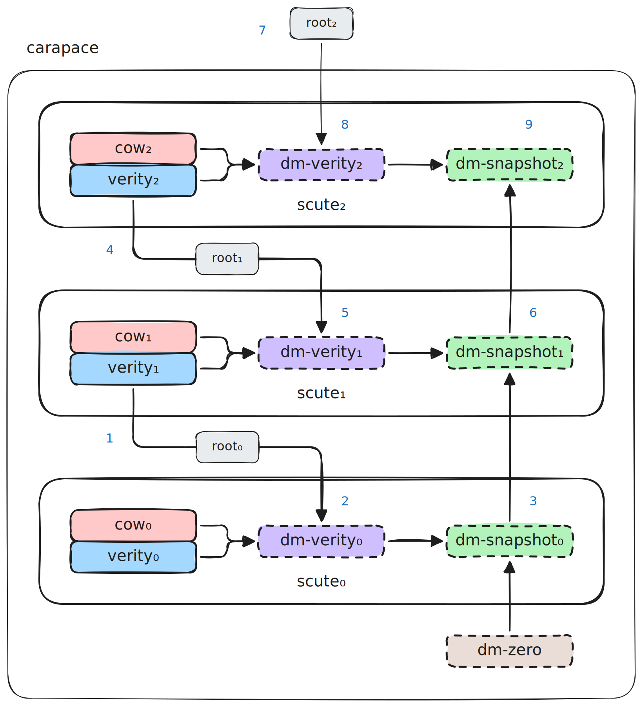

# Carapace: A Cryptographically Composed Read-Only Block Device

## Overview

Carapace is a block device layering mechanism. A **scute** is a single layer, expressed as a pair of content-addressable blobs: one holding copy-on-write data in dm-snapshot format, one holding a dm-verity hash tree. A **carapace** is the composed stack of scutes, assembled into a unified, integrity-protected, read-only block device.

A carapace is bound cryptographically through salt propagation: each scute's dm-verity salt is prefixed with the previous scute's root hash, and the full salt (prefix plus any builder-defined suffix) is hashed into the verity tree. A single trusted value — the top scute's verity root — validates the entire chain.

This specification has three levels:

1. **Carapace core.** The format of individual scutes and the salt-chain binding between them. Deployment-agnostic: scutes are bytes, and the core is invariant across how they are stored, transported, or enumerated.
2. **GPT deployment pattern.** An optional convention for deploying scutes as GPT partitions with Discoverable Disk Image (DDI) PARTUUIDs. Useful when self-describing on-disk layout matters. Opt-in.
3. **Informative implementation notes.** Non-normative guidance for specific contexts (e.g., confidential-VM VMMs).

Any application needing compositional read-only block layers with cryptographic binding to a single trust anchor can use this mechanism.

## Terminology

| Term | Meaning |
|---|---|
| Scute | A single layer: a cow file and a verity file |
| Carapace | The composed stack of scutes, presented as a unified block device |
| `rootᵢ` | The dm-verity root hash of the scute at chain position i |
| `N` | The number of scutes in a carapace. Scutes are indexed 0 through N-1 |
| `rootₙ₋₁` | The top scute's root hash; the trust anchor |
| `saltᵢ` | The dm-verity salt used when building the scute at position i |
| Consumer | The entity that verifies and mounts a carapace |

## Applications

Carapace is a general-purpose primitive. Representative applications:

- **Confidential computing.** Guest VM root block devices assembled inside the guest trust boundary, with `rootₙ₋₁` measured into attestation state.
- **Verified boot.** Signed kernel command line or secure-boot-anchored firmware supplies `rootₙ₋₁`; the rest of the system composes from scutes.
- **Embedded systems and appliances.** Read-only firmware with cryptographic integrity; incremental field updates delivered as additional scutes.
- **A/B update systems.** Two carapaces share a common base; atomic switch between them without re-fetching shared content.
- **Reproducible computing environments.** Bit-exact, tamper-evident images for research or compliance workloads.
- **Forensic mounts.** Integrity-verified read-only access to evidence with layered analysis annotations.
- **Build systems with cryptographic provenance.** Each build stage as a scute; a chain of roots proves the build pipeline.
- **Over-the-air updates for vehicles or IoT.** Base firmware plus delta scutes with on-device cryptographic verification.

These applications differ in where `rootₙ₋₁` comes from, how scute artifacts are distributed, and what the adversary model looks like. The carapace mechanism is invariant across them.

## Threat Model

The storage substrate holding scute artifacts is untrusted. An adversary with full control over stored bytes, partition metadata, and transport cannot cause a consumer to accept tampered content or produce a silently compromised composed device.

Specifically, an adversary may:

- Serve arbitrary bytes for any scute blob read.
- Under the GPT deployment pattern: reorder, omit, add, or modify GPT entries; choose any value for partition type GUIDs, PARTUUIDs, attributes, and names.
- Substitute any scute artifact with a different one.

An adversary cannot:

- Modify the trusted `rootₙ₋₁`. Delivery of `rootₙ₋₁` to the consumer via a trusted channel is a prerequisite of using carapace; the nature of that channel is application-defined (attestation measurement, signed kernel cmdline, TPM sealing, secure-boot-anchored input, operator-provided value, etc.).
- Modify the consumer's implementation. How the consumer's integrity is assured is also application-defined.

Confidentiality, availability, and side-channel resistance are out of scope.

See [Defeating Adversarial Behavior](#defeating-adversarial-behavior) for how each adversary capability is neutralized.

## Core Architecture

A scute consists of two byte sequences:

- A **cow file**: a dm-snapshot persistent exception store.
- A **verity file**: a dm-verity superblock followed by a hash tree computed over the cow file.

A carapace is an ordered sequence of N scutes, composed via dm-snapshot and dm-verity stacking. Every scute in a carapace MUST declare identical chain parameters (hash algorithm, block sizes, format version, snapshot chunk size); these parameters are set by the base scute and inherited by all others.

The trust chain is established by salt propagation. Every scute's dm-verity salt consists of a **required prefix** (size equal to the digest size of the chain's hash algorithm) followed by an **optional builder-defined suffix**. The prefix encodes the parent root, with a sentinel value (`digest_size` zero bytes) marking the base scute as having no parent.

- For every non-base scute at position `i`: the salt begins with a required prefix equal to `rootᵢ₋₁`, optionally followed by a builder-defined suffix.
- For the base scute: the salt begins with a required prefix of `digest_size` zero bytes (the sentinel marking "no parent"), optionally followed by a builder-defined suffix. Conventionally the suffix is `digest_size` random bytes, which makes `root₀` (and therefore `rootₙ₋₁`) unique per build.
- For every scute: `rootᵢ = verity_root(cowᵢ, saltᵢ)`, computed over the full salt (prefix plus any suffix) during build.

At mount time, the consumer walks the chain, computes `rootᵢ` for each scute using its declared full salt, verifies `rootₙ₋₁` matches the trusted value, and configures the device-mapper stack.

### Example: Three-Scute Carapace

The diagram below shows a complete carapace with three scutes from the perspective of a chain-assembly tool. Each scute has a pair of on-disk files (`cowᵢ`, `verityᵢ`) and two virtual devices that the tool constructs (`dm-verityᵢ`, `dm-snapshotᵢ`). The carapace is the ordered stack of all three scutes plus the snapshot chain's base (`dm-zero`); everything inside the outer rounded rectangle is the carapace itself. The value `root₂` enters from outside — it is the only input the tool needs that is not already on disk.



The numbered steps trace the assembly algorithm. The tool works from the bottom up, building each layer's virtual devices once it has the expected root for that layer:

1. Read `root₀` from `verity₁`'s salt field.
2. Build `dm-verity₀` from `cow₀` + `verity₀`, using `root₀` as the expected root.
3. Build `dm-snapshot₀` with `dm-zero` as origin and `dm-verity₀` as the CoW device.
4. Read `root₁` from `verity₂`'s salt field.
5. Build `dm-verity₁` from `cow₁` + `verity₁`, using `root₁`.
6. Build `dm-snapshot₁` with `dm-snapshot₀` as origin and `dm-verity₁` as the CoW device.
7. Read `root₂` from the trusted channel.
8. Build `dm-verity₂` from `cow₂` + `verity₂`, using `root₂`.
9. Build `dm-snapshot₂` with `dm-snapshot₁` as origin and `dm-verity₂` as the CoW device.

`dm-snapshot₂` now contains the trusted read-only filesystem — this is the composed carapace.

The only input from outside the carapace is `root₂`. Every other root value is read from the salt prefix of the verity file one layer above. Scute 0 is the base: its salt is entirely builder-defined (conventionally random bytes) with no prefix constraint, and its snapshot's origin is `dm-zero`. If at any step `dm-verityᵢ` refuses to activate with the supplied root — because the hash tree in `verityᵢ` does not hash to the expected value — assembly fails and no dm-snapshot is produced.

## On-Disk Format (Normative)

### Chain Parameters

A carapace is parameterized by a set of properties that govern the hash tree structure and the composed block device's geometry. These parameters are declared by the **base scute** (`root₀`) and inherited by every other scute in the chain.

The chain parameters are:

| Parameter | Source |
|---|---|
| Hash algorithm (`algorithm`) | dm-verity superblock |
| Data block size (`data_block_size`) | dm-verity superblock |
| Hash block size (`hash_block_size`) | dm-verity superblock |
| Hash type (`hash_type`) | dm-verity superblock |
| Superblock version (`version`) | dm-verity superblock |
| Snapshot chunk size (`chunk_size`) | dm-snapshot `disk_header` |

All non-base scutes in a carapace MUST declare chain parameters identical to the base scute's. The consumer MUST validate this and reject any chain with differing parameters between layers.

Every scute's salt prefix is `digest_size` bytes (e.g., 32 bytes for `sha256`, 64 bytes for `sha512`), so `salt_size` MUST be at least `digest_size`. Non-base scutes carry the parent root in the prefix; the base scute carries `digest_size` zero bytes as a sentinel.

### Parameter Whitelist

The consumer accepts chains whose declared parameters lie within an explicit, reviewed allowlist; everything else is rejected. At minimum, the consumer MUST require:

| Parameter | Permitted values |
|---|---|
| `algorithm` | `sha256` (REQUIRED). `sha512` (OPTIONAL — consumers MAY accept). |
| `version` | `1` |
| `hash_type` | `1` |
| `data_block_size` | `4096` |
| `hash_block_size` | `4096` |
| `chunk_size` | `8` (sectors; equivalent to 4096 bytes) |

Consumers MAY add to the whitelist as new values are reviewed and adopted (e.g., a future spec version adding SHA-3). The whitelist is part of the consumer's trusted computing base; integrity of the whitelist is assured by whatever mechanism assures the consumer's own integrity.

The same whitelist applies to every scute — base and non-base alike. Equality with the whitelisted constants is therefore both a per-scute legality check and the chain-consistency check (since every scute must equal the constant, transitively every scute equals every other).

A consumer that does not implement a whitelisted algorithm at compile time (i.e., its crypto library does not include it) MUST fail cleanly with an unsupported-algorithm error, distinct from a whitelist rejection. (For the v1 spec there is no practical distinction — the only required algorithm, `sha256`, is implemented by every consumer.)

### Recommended Default Profile

Builders SHOULD use the following chain parameters unless a specific reason exists to deviate:

| Parameter | Recommended value |
|---|---|
| `algorithm` | `sha256` |
| `data_block_size` | 4096 |
| `hash_block_size` | 4096 |
| `hash_type` | 1 |
| `version` | 1 |
| `chunk_size` | 8 sectors (4096 bytes) |

This profile matches typical filesystem page sizes, has broad kernel support, and uses a hash algorithm with current cryptographic standing.

### cow File Layout

Each cow file is a dm-snapshot persistent exception store as defined by the Linux kernel (`drivers/md/dm-snap-persistent.c`). That upstream format governs the on-disk layout and is not redefined here; this specification constrains only the parameter values that carapace requires.

For reference, at the time of this specification the disk header at the start of the first chunk is:

```c
// Informative: kernel-defined structure, subject to upstream evolution.
struct disk_header {
    uint32_t magic;       // 0x70416e53 ("SnAp")
    uint32_t valid;       // 1
    uint32_t version;     // 1
    uint32_t chunk_size;  // in 512-byte sectors
};
```

All fields little-endian. The exception table and data chunks follow per the standard persistent format.

**Normative requirements:**

- The cow file MUST be a valid dm-snapshot persistent exception store as the kernel defines it at the time of consumption.
- `chunk_size` MUST equal the chain's `chunk_size` (a chain parameter set by the base scute).

### verity File Layout

Each verity file begins at offset 0 with a dm-verity superblock as defined by `cryptsetup` (`lib/verity/verity.c`), followed by the hash tree. The superblock and hash tree layout are governed by that upstream format and are not redefined here; this specification constrains only the field values and salt semantics that carapace requires.

For reference, at the time of this specification the superblock layout is:

```c
// Informative: upstream-defined structure, subject to cryptsetup evolution.
struct verity_sb {
    uint8_t  signature[8];    // "verity\0\0"
    uint32_t version;         // chain parameter
    uint32_t hash_type;       // chain parameter
    uint8_t  uuid[16];
    uint8_t  algorithm[32];   // chain parameter
    uint32_t data_block_size; // chain parameter
    uint32_t hash_block_size; // chain parameter
    uint64_t data_blocks;     // per-scute
    uint16_t salt_size;       // per-scute
    uint8_t  _pad1[6];
    uint8_t  salt[256];       // see below
    uint8_t  _pad2[168];
};
```

The hash tree follows the superblock, aligned to `hash_block_size`.

**Normative requirements.**

- The verity file MUST be a valid dm-verity image as the upstream format defines it at the time of consumption.
- The superblock fields annotated `// chain parameter` above MUST equal the chain's corresponding value (see [Chain Parameters](#chain-parameters)).
- `salt_size` MUST be at most 256 and at least `digest_size`. Every scute (base and non-base alike) carries a `digest_size`-byte prefix; the rule is uniform.
- The salt contents are subject to the salt structure rules below.

**Salt structure (normative).** The salt consists of a `digest_size`-byte prefix followed by an optional suffix.

**Prefix.**

- **Non-base scute** (position `i` where `i > 0`): the prefix occupies bytes `0..digest_size` and MUST equal `rootᵢ₋₁` (the preceding scute's root hash).
- **Base scute** (position `0`): the prefix occupies bytes `0..digest_size` and MUST be `digest_size` zero bytes. This sentinel marks "no parent" and is the consumer's signal that the chain walk terminates here. The probability of a real parent root colliding with the sentinel is `2⁻²⁵⁶` for `sha256` (negligible).

**Suffix.** Bytes following the prefix are builder-defined: any content, opaque to the consumer. Conventional practice for the base scute is `digest_size` random bytes, which makes `root₀` (and therefore `rootₙ₋₁`) unique per build. The suffix on non-base scutes permits builders to distinguish otherwise-identical scutes (different instances, builder-provenance markers, experimental metadata). Omitting the suffix (so the prefix fills the salt) yields deterministic identity: same content plus same parent produces the same `rootᵢ`.

Trust properties depend only on the prefix. The suffix affects `rootᵢ` because dm-verity hashes the full salt into the tree, but the consumer's trust check validates the prefix (against the expected parent root, or against the zero sentinel for the base) and relies on the salt-chain cascade to anchor at `rootₙ₋₁`.

### Trust Anchor

`rootₙ₋₁`, the top scute's verity root, is the sole cryptographic anchor. It MUST be delivered to the consumer through a trusted channel. This specification does not prescribe the channel.

### Specification Constants

The following values are fixed by this specification. All consumers use these exact values.

| Constant | Value | Role |
|---|---|---|
| `ZERO_START` | `0` | Starting sector of the dm-zero mapping table entry |
| `ZERO_COUNT` | `2⁵⁶` sectors (32 EiB at 512-byte sectors) | Number of sectors in the dm-zero mapping table entry, i.e. the apparent size of the dm-zero device under the base scute's snapshot origin |

A consumer also holds these per-consumer values, whose integrity is assured by whatever mechanism assures the consumer's own integrity:

| Value | Role |
|---|---|
| Parameter whitelist | Accepted values per the [Parameter Whitelist](#parameter-whitelist) section |
| Supported hash algorithms | Set of algorithms the consumer can actually compute |

## Build Process (Normative)

A builder produces a carapace by constructing each scute's cow file (a dm-snapshot persistent exception store) and verity file (a dm-verity image), in an order that respects the salt-chain dependency. For scute `i > 0`, constructing the verity file requires `rootᵢ₋₁`; therefore the scutes MUST be built from base (position 0) upward.

For each scute:

- The cow file MUST be constructed so that, when used as a dm-snapshot CoW device layered on top of the scute at position `i−1` (or dm-zero, for the base), it produces the intended content for this layer.
- The verity file MUST be constructed with `chain_params` matching those of the base scute, with `salt_size` and `salt` contents satisfying the salt structure rules (see [verity File Layout](#verity-file-layout)).
- `rootᵢ` is the dm-verity root hash computed from the cow file and the full salt.

The base scute's salt prefix is `digest_size` zero bytes (the no-parent sentinel); the builder chooses the suffix (typically `digest_size` random bytes to produce a unique `root₀` per build). For each non-base scute the builder independently chooses whether to supply a non-empty salt suffix beyond the parent-root prefix.

Packaging and distribution of cow and verity files are outside the scope of this specification.

## Consumer Interface (Normative)

The carapace core imposes minimal requirements on the consumer's environment. A consumer MUST be able to:

- Obtain the trusted `rootₙ₋₁` value.
- Given a sequence of scutes in chain order, obtain each scute's cow file and verity file as block-addressable ranges.

How the consumer resolves scute identities, discovers chain order, and locates blobs is a **deployment concern**, not part of the carapace core. Deployment patterns are described separately; the GPT pattern below is one such pattern.

## Consumer Verification and Setup (Normative)

Given an ordered sequence of scutes and a trusted `rootₙ₋₁`, a consumer MUST, before exposing the composed device, ensure all of the following:

**Chain parameter validity.** The base scute's verity superblock has a valid dm-verity signature. The values it supplies for `algorithm`, `data_block_size`, `hash_block_size`, `hash_type`, and `version` are the chain's `chain_params` and MUST each appear in the consumer's whitelist (see [Parameter Whitelist](#parameter-whitelist)). The consumer MUST support `chain_params.algorithm`; an unsupported algorithm is a hard failure.

**Per-scute validation.** For each scute `i ∈ [0, N)`, its verity superblock's `algorithm`, `data_block_size`, `hash_block_size`, `hash_type`, and `version` MUST equal the corresponding `chain_params` value. `salt_size` MUST be at most 256 and at least `digest_size` (the digest length of `chain_params.algorithm`).

**Salt chain validation.** For each scute `i > 0`, the first `digest_size` bytes of the verity superblock's salt MUST equal the consumer-computed `rootᵢ₋₁`. For the base scute (`i = 0`), the first `digest_size` bytes MUST be all zero — the sentinel marking "no parent." Here `rootᵢ` is computed from the cow file and the full salt (`salt[0..salt_size]`) per the dm-verity construction using `chain_params.algorithm`. The chain walk identifies the base scute by detecting the zero-prefix sentinel; no out-of-band base marker is required.

**Trust terminus.** The computed `rootₙ₋₁` MUST equal the trusted `rootₙ₋₁`.

**Chunk-size consistency.** The `chunk_size` field in each scute's dm-snapshot header (read through the activated dm-verity device so that it is integrity-protected) MUST be identical across all scutes and MUST equal the whitelisted `chunk_size` (see [Parameter Whitelist](#parameter-whitelist)).

**Device setup.** Once the above checks pass, the consumer activates the device-mapper stack bottom-up: a dm-zero device with the mapping table entry `ZERO_START ZERO_COUNT zero`, then for each scute in order `0..N` a dm-verity device over the cow and verity files (using the computed `rootᵢ` as the expected root and the superblock's salt contents), then a dm-snapshot device whose origin is the previous layer (dm-zero for the base, the prior snapshot otherwise) and whose CoW device is the current scute's dm-verity device. The top snapshot is the composed carapace.

Any failure at any step is a hard failure; the composed device MUST NOT be exposed. Subsequent runtime integrity failures from dm-verity on block reads are also hard failures.

Deployment patterns that provide self-describing on-disk layouts may require an additional discovery phase to enumerate scutes in chain order before this procedure. The GPT deployment pattern below specifies such a phase.

## GPT Deployment Pattern (Normative When Used)

This section defines an optional convention for deploying scutes as partitions on one or more GPT-formatted block devices. Applications MAY use this pattern when they want self-describing on-disk layout; applications that manage scute enumeration through other means (manifest files, directory conventions, streaming sources, orchestrator-provided metadata, etc.) MAY ignore this section.

### Scope

Scutes under this pattern are stored as pairs of GPT partitions. The partitions MAY all reside on a single block device or MAY be distributed across multiple GPT-formatted block devices visible to the consumer. The consumer enumerates partitions across all visible GPT devices and operates on the union.

### Partition Types

| Role | Type GUID |
|---|---|
| SCUTE_COW | `11dd804a-e1bf-4ab3-98c1-f9f48ceedbf1` |
| SCUTE_VERITY | `40bb9571-2972-4547-b580-6a8cb13fd7d1` |

The chain walk identifies the base scute by the zero-prefix sentinel in its salt (see [Consumer Verification](#consumer-verification-and-setup-normative)); no GPT attribute is involved.

### PARTUUID Assignment

For every scute pair:

```
cow_partition.partuuid    = root[i][ 0..16]
verity_partition.partuuid = root[i][16..32]
```

PARTUUIDs are globally unique identifiers; the consumer resolves them across the union of visible GPT partitions, regardless of which device each partition resides on.

### Chain Walk

The consumer enumerates scutes by walking backward from the top:

```
# Locate the top scute using the trusted root[N-1]
verity_top = find_partition_by_partuuid(root[N-1][16..32])
If not found or type_guid != SCUTE_VERITY: FAIL.
cow_top    = find_partition_by_partuuid(root[N-1][0..16])
If not found or type_guid != SCUTE_COW: FAIL.

scutes = [(cow_top, verity_top)]
current_verity = verity_top

loop:
    sb = read_verity_superblock(current_verity)
    # (standard validations as in Consumer Verification)

    If sb.salt[0..digest_size] == 0:
        Break.  # base reached (zero-prefix sentinel)

    salt = sb.salt[0..32]   # parent root (first 32 bytes regardless of digest_size)
    parent_cow    = find_partition_by_partuuid(salt[0..16])
    parent_verity = find_partition_by_partuuid(salt[16..32])
    If either not found: FAIL.
    If parent_cow.type_guid != SCUTE_COW: FAIL.
    If parent_verity.type_guid != SCUTE_VERITY: FAIL.

    scutes.prepend((parent_cow, parent_verity))
    current_verity = parent_verity

# scutes is now ordered base -> top; proceed to Consumer Verification.
```

After the walk, the consumer has an ordered list of (cow, verity) pairs to feed into Consumer Verification and Setup.

### Discovery Integrity

Discovery via DDI PARTUUIDs is not cryptographically protected — an adversary may modify GPT entries freely. Trust is established by the salt chain terminating at the trusted `rootₙ₋₁`, with the base scute self-identifying via its zero-prefix sentinel. Any adversary manipulation of GPT metadata or partition contents that does not produce a chain whose terminus equals `rootₙ₋₁` will cause verification to fail at the terminus check; manipulation that does produce a matching terminus would require breaking the preimage resistance of the chain's hash algorithm. The zero-prefix sentinel is itself part of the dm-verity-hashed salt: an adversary cannot forge a non-base scute as base without invalidating its hash tree.

## Implementation Notes (Informative)

### Confidential-VM VMMs

A VMM implementing carapace support for confidential VMs using the GPT deployment pattern may find it convenient to synthesize a single virtual GPT disk containing all scute partitions, presented to the guest as one virtio-blk device. Benefits:

- The guest discovers all scutes through a single block device, simplifying the guest-side discovery code path.
- The VMM already mediates scute storage (pulling blobs from untrusted sources) and is well-positioned to lay out the synthesized GPT.
- virtio-blk is the minimal paravirtualized block transport; exposing a single device minimizes the virtual hardware surface in the guest.

This is an implementation choice, not a requirement. A VMM may equally well expose multiple virtio-blk devices if that better suits the orchestration model.

### Distribution Without Verity Files

A scute's verity file is a deterministic function of its cow file, its full salt, and the chain parameters. The dm-verity construction has no implementation degrees of freedom: its byte layout is fixed by what the kernel will accept on activation, so two correct implementations produce bit-identical verity files from identical inputs.

A builder or distribution layer therefore need not ship verity files at all. It MAY instead ship the cow files alongside each scute's full salt, the chain parameters, and the trusted `rootₙ₋₁`, and rely on the consumer to reconstruct each verity file locally before running [Consumer Verification and Setup](#consumer-verification-and-setup-normative). Reconstruction is single-pass over cow data the consumer was already going to read at activation time. The reduction in distribution size is the verity overhead — roughly 1/127 of the cow size for the recommended default profile.

The trust properties stated in [Threat Model](#threat-model) are preserved without additional consumer-side work: the salt-chain and trust-terminus checks already operate on consumer-computed `rootᵢ` values, regardless of whether the verity file was received or reconstructed. Streaming reconstruction also admits a fail-fast pipeline — the chain commitment for scute `i` can be checked as soon as scute `i`'s tree is built, aborting a multi-scute pull at the boundary instead of after the full download.

This is an implementation choice, not a requirement. The on-disk format the kernel consumes (see [On-Disk Format](#on-disk-format-normative)) is unchanged either way; only what crosses the wire between builder and consumer is at issue.

## Design Rationale

### Trust versus discovery

Trust and discovery are solved by separate mechanisms:

- **Trust** (binding each layer to its parent): the salt chain. Any tampering cascades to `rootₙ₋₁` and fails the trust-anchor check.
- **Discovery** (finding which blobs form each scute): deployment-specific. Under the GPT pattern, DDI PARTUUIDs.

Discovery is unverified; trust is established by the chain terminating at the trusted `rootₙ₋₁`.

### Why salt propagation instead of stored parent references

An earlier design considered carrying each scute's parent `rootᵢ₋₁` inside its cow file as explicit metadata under verity. Salt propagation achieves the same binding using only the dm-verity salt field that already exists for this purpose (domain separation per verity volume). No custom parser, no custom format.

### Why the base scute uses a zero-prefix sentinel + random suffix

Every scute's salt has the same shape: `digest_size` bytes of "parent root" prefix followed by an optional suffix. For non-base scutes the prefix is the actual parent root. For the base scute there is no parent, so the prefix is `digest_size` zero bytes — a sentinel value that the consumer's chain walker uses to terminate. A real parent root would collide with the sentinel only at probability `2⁻²⁵⁶` for `sha256` (negligible); a substituted non-zero "fake parent root" would not match any visible verity partition's PARTUUID, causing a hard failure at parent lookup. The random suffix (conventionally `digest_size` bytes) gives every base build a unique `root₀`, cascading to `rootₙ₋₁`.

This design moves the chain-terminator marker into the dm-verity-hashed salt itself, so an adversary cannot toggle "is base" without invalidating the scute's hash tree. No GPT attribute flag, no out-of-band signal, no container-format dependency — chain termination is a property of the verity superblock content.

### Why `rootₙ₋₁` is the only trust anchor

Everything else is either content-derived (PARTUUIDs, roots, salts, chain parameters read from the base scute), fixed by this specification (`ZERO_START`, `ZERO_COUNT`), or a property of the consumer implementation (the parameter whitelist, the supported set of hash algorithms). Additional anchors would be redundant.

### Why standard on-disk formats throughout

The dm-verity superblock carries salt and verity parameters; the dm-snapshot persistent header carries the CoW format identity. Using these standards avoids duplicating what they provide and keeps the parsing surface small.

### Why chain parameters are defined by the base scute

A carapace is a single stacked block device, and its hash-tree and block-geometry properties must be consistent across all scutes: a non-base scute cannot meaningfully use a different hash algorithm or block size than the base. Treating the base scute as authoritative and requiring upper scutes to match puts one copy of the truth on-disk in a content-addressed location, avoiding a separate manifest, a per-chain parameter channel, or consumer-side profile allowlists.

### Why chain parameters are checked against a whitelist rather than a blocklist

A blocklist permits any value not yet known to be unsafe; that is the wrong default for a security-critical primitive. New attacks and weakened algorithms appear faster than fielded consumers can be patched, so a blocklist trails real risk by months. A whitelist inverts the asymmetry: a chain's parameter envelope is exactly the set the consumer has explicitly reviewed, and unfamiliar values fail closed. The cost is that adding a new algorithm requires bumping the spec version and rolling out updated consumers — but the spec already requires consumers to read every historical version, so the rollout is amortized over the same upgrade cadence consumers already follow.

### Why the salt has a required prefix and an optional suffix

For non-base scutes, the prefix carries the chain's trust binding: it is the parent's root hash, which the consumer validates. The suffix is builder-defined and opaque to the consumer. Setting the suffix to empty yields deterministic scute identity — same content plus same parent plus same parameters produces the same `rootᵢ` — which enables content-addressed caching, reproducible builds, and cross-builder dedup. Builders who want to distinguish otherwise-identical scutes (different instances, provenance markers) use a non-empty suffix. Trust properties depend only on the prefix; the suffix affects `rootᵢ` but plays no role in the consumer's trust check beyond whatever cascade effect it has on subsequent chain values. The base scute has no prefix constraint — its whole salt is builder-defined, typically random — and contributes only its resulting `root₀` to the chain.

### Why `ZERO_COUNT` is a specification constant

dm-zero requires a size at activation time; that size is one of the inputs to the dm-zero mapping table entry. Making it a per-carapace value would require a signed communication channel between the builder and the consumer with no clean home. Making it per-consumer would fragment the interop surface — a carapace that works on one consumer might fail on another.

The chosen value (`2⁵⁶` sectors ≈ 32 EiB) is far above the maximum size of any distributable filesystem: larger than ext4's 1 EiB ceiling, at parity with btrfs and XFS (16 EiB), and well below 2⁶³ so there is no signed/unsigned arithmetic ambiguity in any plausible implementation. dm-zero is virtual; declaring a huge size costs nothing at runtime. Any carapace whose actual composed device size is smaller (which is every realistic carapace) sees the extra sectors as unused tail.

## Defeating Adversarial Behavior

This section enumerates specific attacks available to the adversary described in the [Threat Model](#threat-model) and shows how each fails.

### Core attacks (all deployments)

| Attack | Mitigation |
|---|---|
| Adversary substitutes a scute's cow file | Verity tree commits to every byte; substitution changes computed `rootᵢ`; chain diverges from trusted `rootₙ₋₁`. |
| Adversary substitutes a scute's verity file | Same. |
| Adversary modifies a salt in a verity superblock | Changes computed `rootᵢ`; cascades to `rootₙ₋₁`; fails. |
| Adversary modifies a scute's chain parameters (hash algorithm, block sizes, etc.) | Consumer validates every scute's parameters match the base's; mismatch causes hard failure. |
| Adversary substitutes the base scute with one declaring non-whitelisted parameters (e.g., sha1) | Consumer rejects on whitelist check before any chain walk. |
| Adversary presents fewer scutes than the chain requires | Chain walk fails to reach a valid `rootₙ₋₁`. |
| Adversary presents extra scutes | Those outside the salt chain from the trusted `rootₙ₋₁` are simply not referenced; those included must still produce a chain terminating at `rootₙ₋₁`. |

### GPT-pattern-specific attacks

| Attack | Mitigation |
|---|---|
| Adversary reorders scutes in GPT | DDI lookup yields wrong partitions or none; chain walk fails. |
| Adversary inserts spurious partitions | Not referenced by any chain walk from `rootₙ₋₁`; ignored. |
| Adversary removes scutes needed by the chain | Parent lookup fails; hard failure. |
| Adversary modifies a verity salt's zero-prefix sentinel (turning a non-base into "base") | Salt change invalidates dm-verity hash for that scute; activation fails. |
| Adversary modifies the base scute's zero prefix to look like a non-base | Walker tries to look up the (forged) parent PARTUUID; partition not found; fails. Even if lookup spuriously succeeded, the chain-derived root would not match the substitute scute's actual root, breaking dm-verity activation. |
| Adversary lies about Disk GUID, partition names, attribute bits | No security-relevant data there; no effect. |

All failure modes are hard failures. No silent compromise.

## Limitations

### Verity tree cross-carapace deduplication

Each scute's verity tree depends on the salt, which depends on the chain below. Two carapaces sharing a base scute content-wise but with different base salt values have different verity tree blobs even for the shared base. cow files deduplicate normally (same bytes, same content); verity trees are per-carapace.

## Glossary

- **DDI**: Discoverable Disk Image specification. Defines the convention where a verity partition pair's PARTUUIDs are derived from splitting the verity root hash.
- **dm-snapshot**: Linux device-mapper target providing copy-on-write snapshots using a persistent exception store format.
- **dm-verity**: Linux device-mapper target providing transparent block-level integrity verification via a Merkle tree.
- **PARTUUID**: The 128-bit unique identifier assigned to a GPT partition (distinct from the partition type GUID).

## References

- UEFI Specification 2.11, Chapter 5: GUID Partition Table Disk Layout.
- Linux kernel: `Documentation/admin-guide/device-mapper/verity.rst`
- Linux kernel: `drivers/md/dm-snap-persistent.c`
- UAPI Group: Discoverable Partitions Specification.
- cryptsetup: `lib/verity/verity.c` — dm-verity superblock structure.

## Related Specifications

Packaging of scute artifacts for distribution, together with application-specific concerns such as associating carapaces with launch-time material (e.g., IGVM files for confidential VMs, boot loaders for verified boot, update payloads for OTA systems), is specified separately by each consumer. This document is limited to the filesystem composition mechanism.
